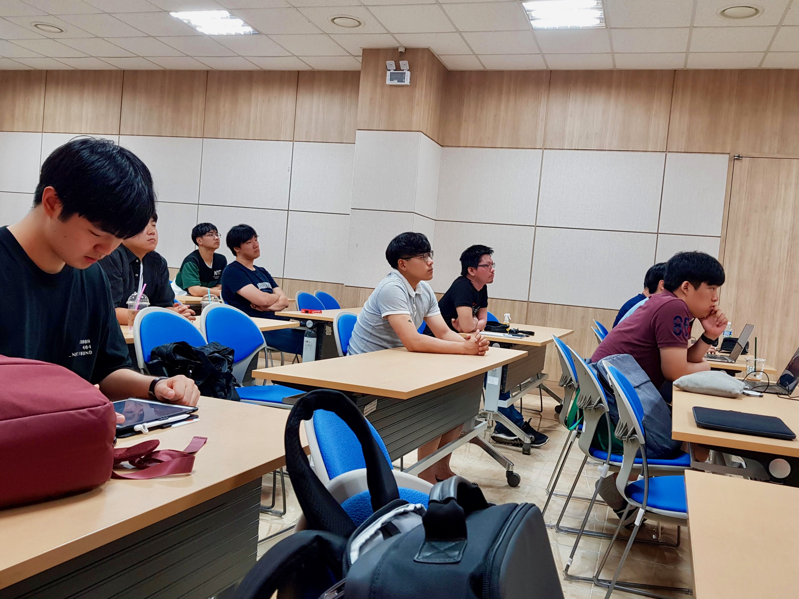
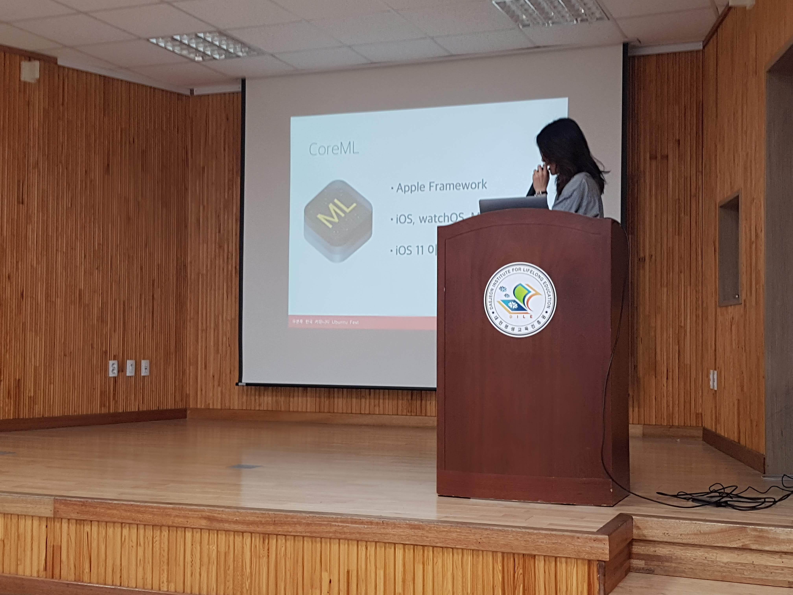
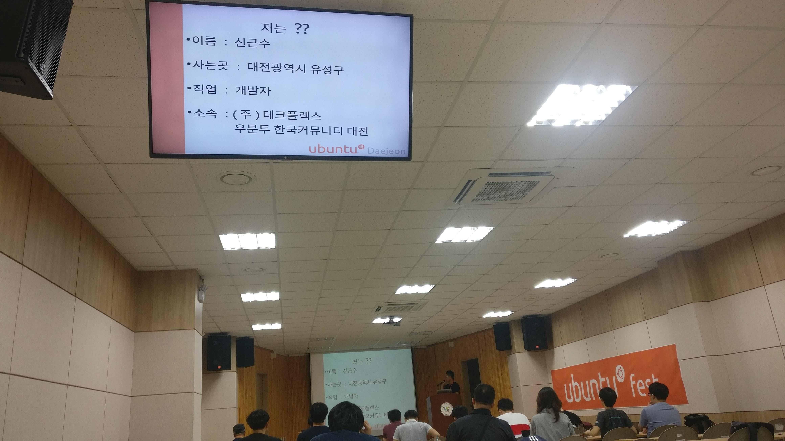
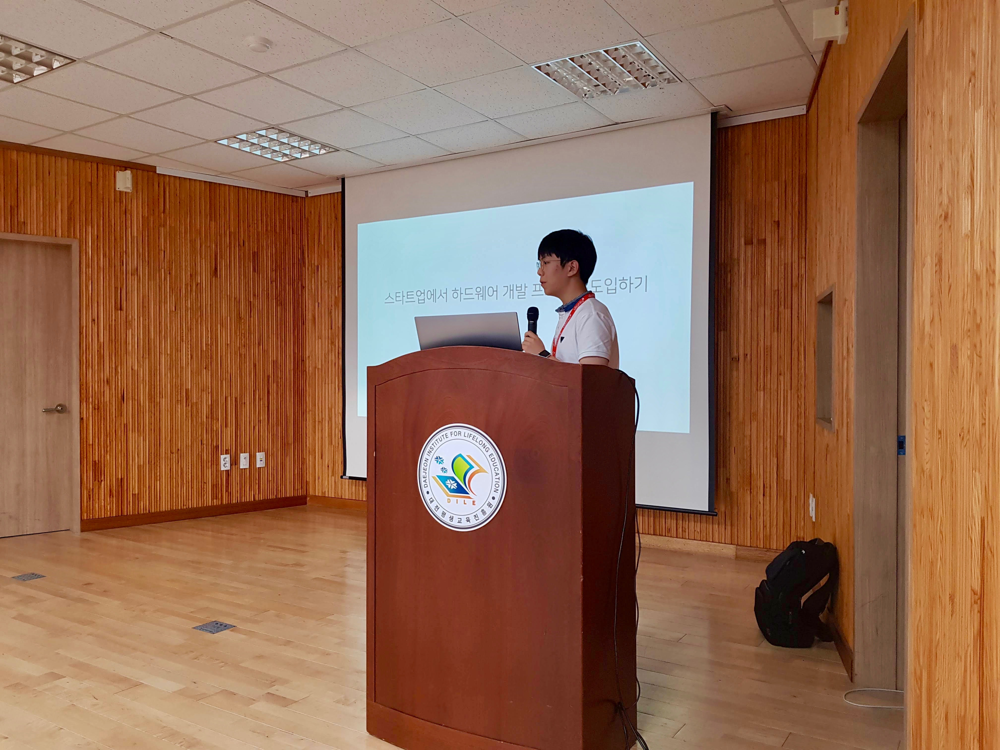
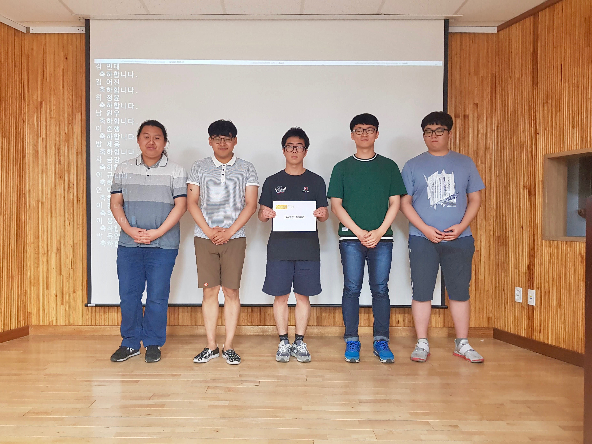
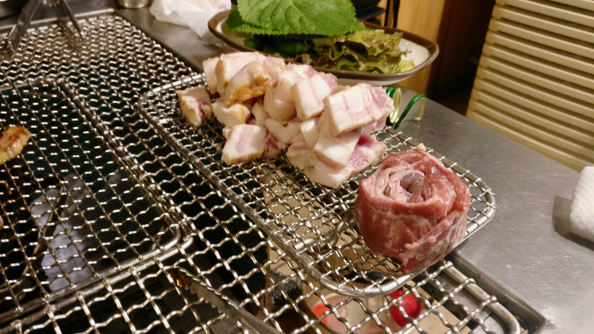

6월 23일 대전에서 Ubuntu Fest가 진행되었습니다. 우분투와 임베디드를 주제로한 이번 행사는 임베디드의 최신동향에서부터 임베디드속 딥러닝까지 다양한 세션이 진행되었습니다.
또한 대전팀이 생긴 이후 첫 세미나였던 만큼 뜻깊은 행사였습니다.

Ubuntu Fest는 다음과 같은 순서로 진행이 되었습니다.

시간 | 일정
--- | ---
13:00 ~ 13:10 (10분) |	등록
13:10 ~ 13:20 (10분) |	일정안내
13:20 ~ 13:40 (20분) |  커뮤니티 소개
13:40 ~ 14:20 (40분) |	미정 - 모바일에 딥러닝 심기
14:20 ~ 14:30 (10분) |	휴식
14:30 ~ 15:10 (40분) |	신근수 - 기계들의 소셜 미디어, MQTT
15:10 ~ 15:20 (10분) |	휴식
15:20 ~ 16:00 (40분) |	신하륜 - 스타트업에서 하드웨어 개발 프로세스 도입하기
16:00 ~ 16:10 (10분) |	휴식
16:10 ~ 16:50 (40분) |	김한욱 - Code-based design vs Model-based design
16:50 ~ 17:00 (10분) |	휴식
17:00 ~ 17:20 (20분) |	라이트닝 토크
17:20 ~ 17:40 (20분) |	광고 및 경품 추첨

## 미정님 '모바일에 딥러닝 심기'
첫번째 세션은 미정님의 '모바일에 딥러닝 심기'였습니다. 
Ubuntu Fest에서 발표해 주시기 위해 서울에서부터 오신 미정님은 이번행사에서 iOS에 Keras로 그림 그리기 게임을 하는 어플을 개발한 내용에 대해 발표 해 주셨습니다.

iOS의 개발 도구 중 하나인 coreML을 이용하여 Python으로 작성된 Keras모델을 iOS에 적용하는 과정과 실제 적용 프로젝트에 대해 발표하셨습니다.
딥러닝이 무엇인지부터 차근차근 알려주셔서 쉽게 내용을 따라갈 수 있었습니다.
특히 프로젝트의 진행 순서에 맞추어 발표를 진행해 주셔서 더욱 쉽게 이해할 수 있었던 것 같습니다.

해당 발표자료는 [이곳](https://www.slideshare.net/UbuntuKorea/ss-102920185)에서 받아보실 수 있습니다.

## 신근수님 '기계들의 소셜미디어, MQTT'
두번째 세션은 신근수님의 '기계들의 소셜미디어, MQTT'였습니다.

개발자라는 소개로 시작한 이번 발표는 재미있게 진행되었습니다.

이미지 자료들이 많아 집중이 잘되고 심심할 틈이 없던 시간이었습니다.
아직 많은분들이 잘 모를법한 MQTT에 대해 강의해 주셔서 유익한 시간이 되었습니다.

해당 발표자료는 [이곳](https://www.slideshare.net/UbuntuKorea/mqtt-102921138)에서 받아보실 수 있습니다.

## 신하륜님 '스타트업에서 하드웨어 개발 프로세스 도입하기'
세번째 세션은 신하륜님의 '스타트업에서 하드웨어 개발 프로세스 도입하기'였습니다.

이번 행사 스폰서였던 SweetFab을 운영하면서 겪었던 문제점과 그것들을 하드웨어개발 프로세스 도입으로 해결하는 내용에 대해 발표하셨습니다.
실제 겪었던 일들과 해결법에 대해 발표해 주셔서 현실감있게 다가왔던 시간이었습니다.

해당 발표자료는 [이곳](https://www.slideshare.net/UbuntuKorea/ss-102922171)에서 받아보실 수 있습니다.

## 김한욱님 'Code-based design VS Model-based design'
마지막 세션은 김한욱님의 'Code-based design VS Model-based design'이었습니다.

MatLab을 통해 Model기반 디자인을 하는 방법과 그의 장점에 대해 발표 해 주셨습니다.
김한욱님은 발표 참여도를 높이기 위해 청자들에게 직접 무대에서 나와 사탕을 나눠주셨습니다. 덕분에 어려운 주제임에도 많은 분들이 집중하여 들을 수 있었습니다.

해당 발표자료는 [이곳]()에서 받아보실 수 있습니다.

## 라이트닝 토크
라이트닝토크의 주제는 다음과 같이 진행되었습니다.

발표자 | 주제
--- | ---
김어진 | 이것은 한 명의 인간에게는 작은 발걸음이지만, 개발자에게는 위대한 도약이다.
최소영 | 제 학교를 소개합니다.
윤성수 | 
신하륜 | GRC 떡상 가즈아~!
한영빈 | 멜팅콘 배너는 어떻게 제작 되었는가

## 광고 및 경품추첨
마지막 세션으로 커뮤니티 광고와 경품추첨 시간이 있었습니다.
많은곳에서 지원해 주신 우분투 핀버튼, 마소 1년 구독권, 스위트보드, 애저 그룹 선풍기 등을 참여자 분들에게 추첨으로 나눠드렸었습니다.

## 회식
모든 행사를 마치고 원하는 참석자분들과 스탭들은 정리 이후에 뒷풀이 회식을 진행했습니다.
10분정도 거리에 있는 '녹슨드럼통'에서 진행하였습니다.

## 관련 링크
- [Ubuntu Fest 공유앨범](https://photos.app.goo.gl/3WWR2UxicaF1VEYR8)
