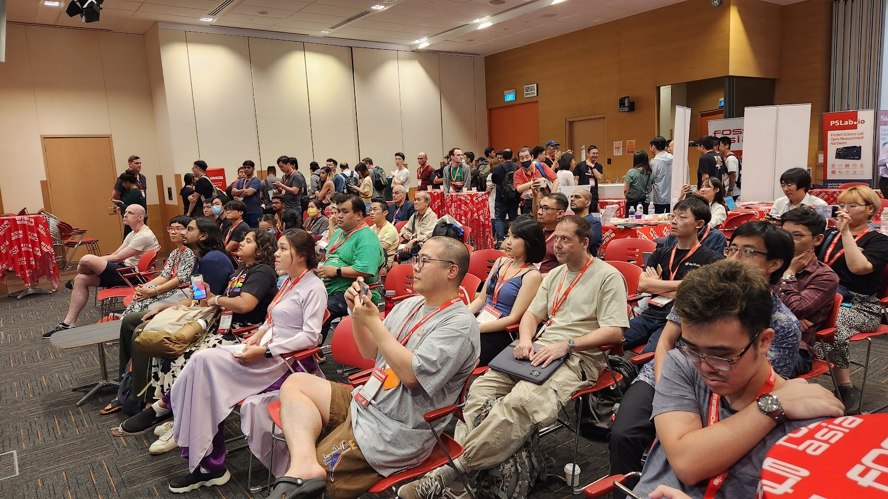

FOSSASIA Summit has been held online in past few years due to COVID-19, but this year, the event has been held in-person finally. I participated in the online event last year as an organizer and worked in the marketing team and the video team. But, I couldn't participate in this year's FOSSASIA event as an organizer. Because when the FOSSASIA team was built this year, I was so busy a few weeks ahead the UbuCon Asia 2022 event in Korea and I didn't even know the team was being created. Instead, this year, Hong Phuc, Director of FOSSASIA, asked me if i would be interested to run a Korean community booth. And for the first time, I opened a booth at an overseas community event.

## How the Korea Community booth team was assembled

My original plan was to organize a Ubuntu Community booth at FOSSASIA this year just like the Ubuntu community booth at [FOSDEM 2023](https://fosdem.org/2023/) that happened earlier this year. Because I basically though it would be also a lot of fun if there can be Ubuntu booth and I can join there. So I contacted Canonical folks and suggested opening a community booth in FOSSASIA. Unfortunately, It was unable to made it happen this time due to the lack of time for Canonical to proceed with the sponsorship for FOSSASIA.

As an alternative, Hong Phuc suggested gathering various communities in Korea to set up a booth, and I thought that would be also something fun to do. So I posted a message in my Facebook timeline to see if anyone is interested. I didn't expect much when I posted, but quite many people than I thought expressed their interests to participate. So I was able to build a team for booth at FOSSASIA with organizers from 4 different communities.

I (Ubuntu Korean Community), Giyeon Bang (C++ Korea), Dong-ha Park (C++ Korea), Justin Yoo (Cloud Bandwagon), Junghwan Park (Cloud Bandwagon, PyTorch Korean User Group), Ga-in Choi (Cloud Bandwagon, Women Who Code Seoul), Hyunah Yoo (Women Who Code Seoul), and Younjung Kang (Women Who Code Seoul) joined in the booth team. Originally, Cho Min-sung (Ubuntu Korean Community) was going to participate, but unfortunately, he couldn't go to Singapore in the due to his own reasons. 

## Preparing Booth and our talk

We planned our booth and a talk (20 minutes) to primarily introduce the activities of each community. At first, I wasn't sure what kind of activities to do in the booth, or even if I had a little idea, I wasn't sure. Meanwhile, I found out that a Taiwanese community booth was organized at FOSDEM 2023, So I asked [OCF (Open Culture Foundation)] (https://ocf.tw/en/) folks, who led the planning and operation of the booth, about how the booth was operated. Singing Li from OCF kindly replied that it was operated with a focus on introducing activities and promoting events of each community joined the booth at the time, and we were able to plan the booth with reference to this. 

In this way, the plan was carried out to introduce the activities of each community. The design and order of standing banners and leaflets for use in the booth were also carried out. On the banner, The QR code was inserted that was linked to Linktree page includes information and website links of each community and its logo(Thanks to Hyunah for working with Linktree website). The leaflet was designed with list of each community logo on the front and introduction of each community on the back. Giyeon and Dongha did a great job in designing, ordering, and bringing it to Singapore. 

For the talk which was total 20 minutes, We prepared it with some introductions and what each community do allocating 5 minutes for each speaker. Since there were similar 5min talks for introducing Ubuntu Korea Community and Women Who Code on last year's FOSSASIA, We could reference those recordings for preparing our talk. 

## Arrived in Singapore! - Preparing for the presentation and setting up the booth
Some of the organizers on the team arrived in Singapore early the day before the event to do some prep for our talk scheduled for day 2, and also to finish working with slides. Thanks to Justin, who booked the meeting room in advance, The team was able to visit the Microsoft Singapore office and gather in the meeting room to prepare for the talk.

On the evening of arrival, there was also a pre-event where FOSSASIA participants gathered to walk and talk on Mariner Bay, Helix Bridge, and then have a dinner at Makansutra Gluttons Bay.

The booth could be also set up in the afternoon before the event held. but since there was not much things to install, and Giyeon and Dong-ha arrived early morning of the event day 1, We installed banners in the booth on the first day of the event, and placed necessary items such as stickers and leaflets.

## Running our Booth & And our talk for introducing our activities
Unlike other events that I usually move my way for participating talks and workshops, At FOSSASIA this year, I usually just stayed at exhibition area to run the booth and had some chat with folks who visited our booth rather participating sessions. I couldn't joined much sessions that i was intrested this time, But it was also a lot of fun to talk with other participants at the booth. 

While running the booth, I could met folks that I met on other events, And also people I only met online before. It was nice to met in-person and have a chat. It was also glad to met folks I worked with UbuCon Asia for several years: Khairul and jipang from Ubuntu Malaysia and Masafumi from Raspberry Pi Japan. I also said hello to Naruhiko and Tristan who I met at UbuCon Asia 2022 before. I also visited LibreOffice, Debian, GrafanaLabs, ONLYOFFICE, COSCUP, Oracle, ExpressVPN and other booth and have a talk with booth staffs.

At Debian booth, I could met Raju who I met on DebConf18. I couldn't have a chat with COSCUP folks a lot since i forgot to visit their booth and met them quite late. But I was able to exchange some swags with them. When I mentioned that I'm from Ubuntu Korea, they remembered that i've contacted Singing before and offered me to run a booth or submitting a proposal for upcoming COSCUP. 

On the lunch time of day 2, I gave the talk with other organizers from our booth team. The stage for our talk was located inside the exhibition area where numerous booths were also installed, and it was also scheduled at lunch time. So I didn't expect that a lot of people would join. But, In fact, Quite a lot of people the I expected joined our talk and see what we do in Korea. I was able to introduce what I do with Ubuntu Korea Community folks and also able to introduce UbuCons (in Asia, EU, Latin America, UbuCon @ SCALE) and Ubuntu Summit which is large global Ubuntu community gathering.  

## Social events at night

When participate in events where various people from all over the world gather just like FOSSASIA, Of course it's always good idea to participate in a session or visit a booth during the day, but I think spending time with other folks with some chat and delicious food is also a great moment of the event. Personally, I enjoyed the pre-event meetup, and also enjoyed the party on the evening of the second day.

## Some talks i enjoyed

As I mentioned, I rarely participated in the session this time, but that didn't mean I couldn't attend at all. To mention some talks or workshops i enjoyed, I could mention those sessions below. 

### [How FOSS has empowered the robotics world: RMF in Singapore](https://www.youtube.com/live/X-wQyW5-O6U?feature=share&t=1285)

It was a talk about ROS, Gazebo and Open RMP a software for working with robotics. I joined this talks since it was scheduled right after the keynote and intrested to learn a bit about ROS since it's frequently mentioned with Ubuntu. I could know that ROS is a set of open source toolkit for working with robotics efficiently, Gazebo is for simulations and Open RMP is for integrating robot with physical spaces where robot can contact with doors, tables, people walking by and more.

### [FluxCD with Helm Controller + Cluster API: Managing workload on multiple Kubernetes Cluster](https://www.youtube.com/live/MUUXlKlYm9w?feature=share&t=10739)

I could learn how the speaker configured multiple K8s clusters and managed workloads across them efficiently. The speaker basically introduced the case study of configuring another cluster on top of other worker cluster and deploy Flux CD on main cluster to control other worker clusters.

### [Open Sourcing a Nonprofit - Transparency and Open Collaboration at Hack Club](https://eventyay.com/e/7cfe0771/session/8108)
It was a short talk about Hackclub, a community and nonprofit for high school hackers. and how they manage their finances transparently with their own opensource project. They also introduced "Bank" service. which is basically a fiscal sponsorship service build with Hackclub's nonprofit legal status and their own opensource system. It was interesting to see the talk, As I've been working with small nonprofit registration and tax accounting for Ubuntu Korea which was quite difficult and saw other Korean communities are also trying to do similar thing. 

### [The practice and experience of openKylin on RISC-V Architecture](https://www.youtube.com/live/P95JECY_D-I?feature=share&t=13362)

Since I've been trying out VisionFive2 which is an RISC-V SBC, I also wanted to learn a bit more with this talk. I could learn how openKylin is being ported to RISC-V chips, and what kind of apps has been ported and available for openKylin on RISC-V. It was interesting to see demonstration of the ROMA laptop, which is a laptop with RISC-V chip but still on prototype stage. (I could hear a big claps when ROMA laptop has been plugged with screen projector.)  

## Conclusion

In last Ubuntu Summit, I stayed in Prague few more days to travel the city. But I couldn't do similar thing since stayig in Singapore was very expensive. But I could join FOSSASIA with folks from various Korean open source community and had great time. And was also glad to met folks I've met before or for the first time.

Thank you Hong Phuc Dang, Mario Behling and the FOSSASIA team for organizing the event and inviting the Korean community. I would also like to thank Philipp Kewisch, Mauro Gaspari and Claire Newman from Canonical who approved my travel grant request that I've submitted with [Ubuntu Donations Funding.](https://discourse.ubuntu.com/t/ubuntu-donations-funding/29)

Lastly, Thanks a lot to organizers from diverse community in Korea for joining the team to setup the booth and also people who encouraged our team in Korea. I belive It would be a lot of fun once again, If we can make thing togather on future events. 

