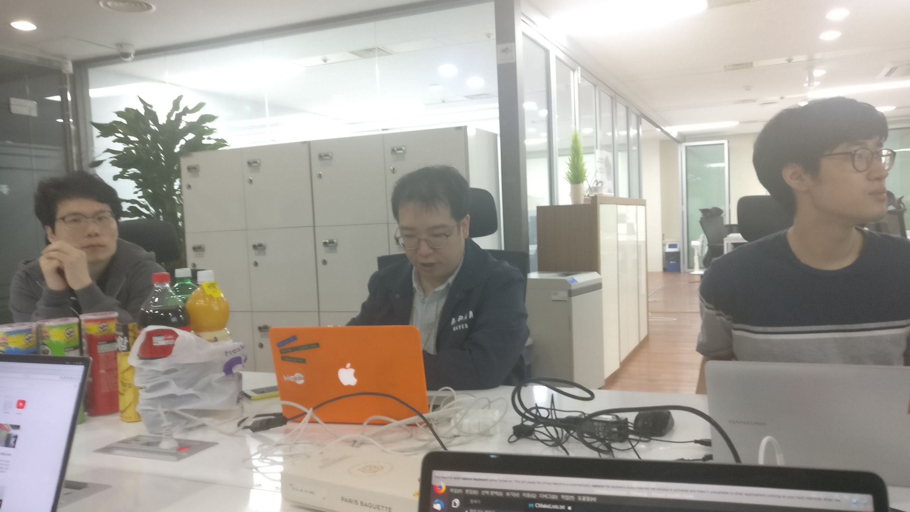

오늘(2018.05.19) 우분투한국커뮤니티의 Hanjp-IM 프로젝트 팀은, GNOME Korea 와 함께 공동으로 조인트 모임을 진행 하였습니다.
이번 조인트 모임은, 지난 4월 26일 서울에서 열린 우분투 18.04 릴리스 파티에 참석하셨던 GNOME Korea 의 조성호님의 제안으로 마련되었습니다.
당시 Hanjp-IM 프로젝트를 이끄시는 김광연님의 프로젝트 중간 발표를 보시고 프로젝트가 잘 진행되도록 돕고 싶으셔서 제안 하셨습니다.
아무래도 구성원 모두가 입력기 개발을 처음 해 보는 상황이라 프로젝트 진행에 어려움을 많이 겪는 시점에서, iBus 쪽에 기여를 해 보신 분들이 GNOME Korea에 계신다 하셔서 조인트 모임을 하면 큰 도움을 받을 수 있을 것 같아 제안을 수락하게 되었습니다.

모임은 아남타워 7층에 위치한 공개SW개발자센터에서 진행되었습니다.

## 1. 한글 입력 처리 과정 요약
먼저 GNOME Korea 의 조성호 님께서 한글 입력 처리 과정에 대해 소개해 주셨습니다. 한글 입력 처리에 널리 쓰이는 libhangul, 리눅스 환경에서 표준처럼 쓰이는 iBus, ibus 와 libhangul 로 구현한 ibus-hangul 에 대해 소개해 주시고 각 프로그램의 구조와 동작방식, 동작 관계에 대해 상태 전이도 등을 간단히 보여주시면서 설명해 주셨습니다.

## 2. 리눅스 데스크톱의 한국어 입력 개요
다음으로는 GNOME Korea 의 류창우 님께서 리눅스 데스크톱에서 한국어 입력이 어떤 과정을 통해 처리 되는지에 대해 설명해 주셨습니다. 또한 입력 처리 시나리오 그림을 몇가지 보여주시면서, 우리가 많이 겪는 한글 끝글자 버그 등의 문제는 단순히 입력기 만의 문제가 아니며, 입력 처리에 관여하는 다양한 소프트웨어도 연관된 복합적인 문제라는 점을 강조하셨습니다. 요즘 언어 입력 처리는 X.org 뿐만 아니라 최근 많은 리눅스 데스크톱에서 기본으로 쓰이는 추세인 Wayland 도 고려해야 하는데, Wayland 에서 자체적으로 입력 처리를 하는 함수도 몇가지 소개해 주셨습니다.

## 3. Hanjp-IM 프로젝트 소개
프로젝트를 이끄시는 김광연 님께서, libhangul 과 비슷한 방식으로 입력 처리를 지원하는 라이브러리인 libhanjp 의 소스코드를 보여 주시면서 Hanjp-IM 프로젝트에 대해 간단히 소개해 주셨습니다. 한글 입력을 통해 최종적으로 일본어 문자 입력을 처리하기 위해, libhangul 을 libhanjp 에서 어떤 방식으로 활용하는지 등에 대해서도 설명해 주셨습니다. 그 외 프로젝트를 하면서 막히는 부분에 대한 논의도 이뤄졌고, 빌드를 할떄 어떤 옵션을 줘야 하는지, 예제 코드와 libhanjp 에서 오류가 나는 부분도 찾고 해결할 방안에 대해서도 논의 하였습니다. 문관경님과 류창우 님께서 libhanjp 테스트를 위한 예제 코드 작성, 컴파일을 위한 Makefile 작성과 gcc 빌드 옵션, gdb 를 이용한 디버깅에 있어 많은 도움을 주셨습니다.

## 4. jhbuild를 활용한 그놈 개발 환경 구축, 빌드, 테스트, 이슈등록
GNOME Korea 의 문관경 님께서 그놈 개발 환경 구축과, 빌드, 테스트 이슈 등록 방법 등에 대해 소개해 주시고, 그놈 개발에서 진입 장벽이 비교적 낮은 Gjs(JavaScript) 개발을 할떄 많이 사용되는 looking glass 에 대해서 소개해 주셨습니다. looking glass 를 이용하여 그뇸 셸의 컴포넌트를 inspect 하는 방법과 그놈 확장 기능 디버깅 방법 등에 대해서 간단한 시연을 통해 보여주셨습니다.

이번 GNOME Korea 와의 조인트 모임을 통해 Hanjp-IM 프로젝트가 많은 도움을 받았고, 또 앞으로 프로젝트를 어떤 방향으로 진행하야 하는지에 대해 많은 생각을 해 볼수 있는 좋은 기회였던 것 같습니다. 특히 컴파일이나 디버깅 쪽에 대한 도움과 조언이 앞으로 프로젝트를 진행하는데 많은 도움이 될 듯 합니다.
프로젝트 모임을 계속 지속적으로 가지다 보니, 이번 모임이 어느세 20회차 모임이 되었습니다. 지금까지도 이렇게 꾸준히 모여 진행한 만큼, 앞으로도 계속 진행하면 좋은 성과가 나올 것 같습니다.

## 참고 링크
- [한글 입력 처리 과정 요약 (슬라이드 자료)](https://www.slideshare.net/gnomekr/20180519-hangul-processing)
- [리눅스 데스크톱의 한글 입력 개요 (슬라이드 자료)](https://www.slideshare.net/gnomekr/korean-input-overview-in-the-linux-desktop)
- [그놈 셸 개발환경 설정과 디버깅 팁 (문관경 님 Google Docs 문서)](https://docs.google.com/document/d/1F5Yf515SgZPimIujRmTgbtY78aVLWS3EpU_z5TRyIJs/edit)
- [그놈 셸 JavaScript 디버깅 (GNOME 공식 문서)](https://wiki.gnome.org/Projects/GnomeShell/DebuggingJavaScript)
- [2018년 5월 그놈 모임 회고 - 그놈 한국 블로그(GNOME KOREA Blog)](http://gnome-kr.blogspot.kr/2018/05/2018-5.html)
- [Hanjp-IM 프로젝트 GitHub 저장소](https://github.com/ubuntu-kr/hanjp-im)
- [Hanjp-IM 프로젝트 우분투한국커뮤니티 위키 문서](https://wiki.ubuntu-kr.org/index.php/HanJP_IM)
- [Hanjp-IM 프로젝트 모임 사진첩](https://photos.app.goo.gl/9hBFNe0jwk40xzox1)

## 사진
사진 일부는 문관경님께서 촬영하신 사진입니다. 촬영해 주신 문관경님께 감사 드립니다.

