지난 주에 모두의 관심 덕택에 UbuCon Korea 2023이 성황리에 개최되었습니다.  
감사드립니다. (__)

[[Discourse/UbuCon Korea 2023이 151명의 참석자와 함께 성공적으로 종료 되었습니다!]](https://discourse.ubuntu-kr.org/t/ubucon-korea-2023-151/49073)  

이번 행사에서는 Key Signing Party도 진행하였는데요.  

GPG 명령어 만으로 서로의 키에 서명하여 이메일로 전달하고,  
서명이 담긴 키를 키서버에 업로드 하는 방법을 알아보도록 하겠습니다.  

## 1. 시작하기에 앞서

1. **[⚠️CAUTION⚠️]**  
  `Key Signing[서명]` (이하, 키사이닝) 을 할 때에는,  
  키사이닝 파티 행사나 다른 계기를 통해,  
  서명하는 본인이 상대방의 신원을 직접 확인한 상태에서 키사이닝을 진행해야 합니다.  
  신원 확인 없이 무조건적으로 키사이닝을 진행하면  
  **본인과 상대방의 키에 대한 신뢰도가 크게 저하될 위험**이 있습니다.  

2. 비대칭키 및 GnuPG가 익숙하지 않은, 그리고 SMTP가 아닌  
  기존 웹메일로 서명한 공개키와 메시지를 함께 전송하실 분들을 대상으로 작성되었습니다.  
  참고로, 비대칭키에 대한 설명은 [Opentutorials(동영상)](https://opentutorials.org/module/5250/29715)나 [RAON CTF(글)](https://raonctf.com/essential/study/web/asymmetric_key)의 내용이 더 상세합니다.  

3. Alternatives  
(1) `caff` 및 `sigining-party` 패키지, 혹은  
(2) `pius` 패키지로도 서명이 가능합니다.  
  Ubuntu/Debian 계열에서는 이 두 가지 방법을 모두 지원합니다. :)  
  해당 내용은 [UCK23/KSP](https://events.canonical.com/event/32/contributions/310/)의 `KSP세션.pdf` 슬라이드에서도 참고할 수 있습니다.  

## 2. '특이점이 온 교환일기'로 알아보는 비대칭키를 통한 메시지 암호화  

- 이미 ssh키 등 비대칭키에 익숙하신 분들은 다음 step으로 넘어가도 무방합니다.  

GnuPG(이하, GPG)는 비대칭키 암호화 기법을 사용합니다.
자물쇠가 달린 교환일기를 예로 들어보겠습니다.  

### (1) 갑자기 교환일기?

  
(네, 알고 계신 그거 맞습니다)

이 교환일기는 보통의 교환일기보다 특이한데요,  
(1) 삽지가 없고 (2) 두 종류의 열쇠가 있습니다.

- 빈 교환일기: 그림과 달리 삽지(종이)가 없는 앞뒤표지와 자물쇠만 있다고 생각해봅시다.  
  암호화를 위한 ASCII-armor 형식 그 자체를 비유하고 싶은데, 마땅치가 않군요.  
- 비밀키: 일기장의 주인이 가지고 있는 열쇠. 일기장의 `만능키`  
  일기장을 잠그고(암호화), 열(복호화) 수 있습니다.  
  일기장의 주인임을 인증하는 역할을 하기에,  
  다른 사람의 손에 쥐어주면 안됩니다.  
- 공개키: 일기장의 주인이 다른 사람들에게 나눠주는 열쇠.  
  빈 일기장에 메시지를 적은 삽지를 끼우고,  
  잠그는(암호화) 역할만 할 수 있습니다.  
  이 공개키 만으로는 일기장의 주인임을 인증할 수 없습니다.  

### (2) 교환일기를 써봅시다

1. Blue와 Green 이라는 사람이 있고, 둘은 ~~특이점이 온~~ 교환일기를 쓰고 싶어합니다.  
2. 각자, 열쇠 한 벌(key pair)을 준비합니다.  
   - Blue는 Blue 자신을 증명할 비밀키와 Green에게 줄 공개키를 준비합니다.  
   - Green도 Green 자신을 증명할 비밀키와 Blue에게 줄 공개키를 준비합니다.  
3. 공개키를 교환합니다.  
   - Blue는 Green에게 Blue의 공개키를,  
     Green은 Blue에게 Green의 공개키를 줍니다.  
4. **Blue**는 Green의 빈 일기장에 끼울 삽지(새로운 텍스트파일)를 준비하고,  
   전하고 싶은 메시지를 적습니다.  
5. **Blue**는 Green에게서 받은 공개키를 이용해서,  
   작성한 삽지를 빈 일기장에 끼우고 잠급니다(암호화).  
   한번 잠근 Green의 일기장은,  
   **Blue**가 가진 Green의 공개키만으로는 다시는 열 수 없습니다.  
   오직 Green이 가진 비밀키로만 Green의 일기를 열 수 있습니다.  
6. **Green**이 Blue가 잠근 본인의 일기를 받았습니다.  
   **Green**은 가지고 있던 본인의 비밀키로 자신의 일기를 열어 내용을 확인합니다.  
7. **Blue** 또한 4 ~ 5 의 과정을 진행합니다.  

## 3. GPG 키사이닝

위의 예시를 실제 GPG 명령어로 옮겨봅시다.  

- 과정 속에서 암호를 입력하라는 란이 있는데, GPG 비밀키의 암호를 입력하면 됩니다.  

### (1) You've got mail!

어라, 이미 '서명을 해놨으니 (어서) 서명을 해달라는' 메일이 와있군요.  

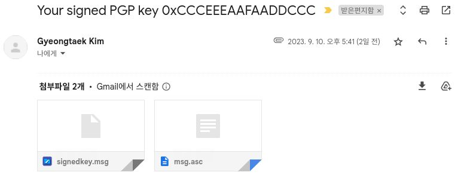

한번 이걸로 해봅시다.  

[Yuki Network Ltd.](https://www.peeringdb.com/net/33182)의 김경택님께서 `signedkey.msg`와 `msg.asc`를 첨부파일로 보내주셨습니다.  

각 파일을 열어보니,  

- `signedkey.msg` 서명에 쓰인 키의 버전 정보를 가지고 있고,  
- `msg.asc`는 `-----PGP MESSAGE-----` 블록을 가지고 있습니다.  
  즉, 경택님의 공개키로 **암호화된 메시지**라는 것을 알 수 있습니다.  
  이 파일들은 아래 단계 중 `(3) 상대방이 서명해준 내 공개키 적용하기
` 에서 다뤄질 것입니다.

  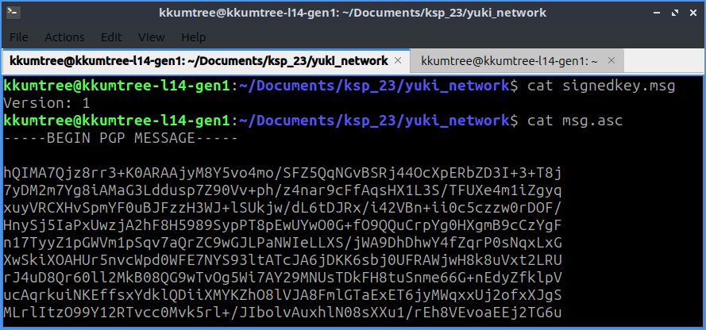

제가 먼저 서명해서 보내고, 메일로 받은 경택님의 서명이 담긴 파일은 그 이후에 다루도록 하겠습니다.  

### (2) 로컬 서명자의 서명하기

1. 이미 키사이닝 파티에서 서로 신원 증명을 하여,  
  서로 서명한 공개키를 주고 받기로 했습니다. (Cross-Signed)  
2. 둘은 사전에 [Ubuntu keyserver](http://keyserver.ubuntu.com/)에 공개키를 게시하였습니다.  
3. 제가 경택님의 공개키를 받도록 하겠습니다.(교환)  
  GPG 핑거프린트를 파티에서 확인하였고, Ubuntu keyserver에서 받기로 하였습니다.  
  GPG키는 **40자의 16진수를 핑거프린트 값**을 갖습니다.  
  키 ID는 보통 핑거프린트 40자 중 뒤의 16자리, `0x<16-Digit-Hex-Code>` 로 표현됩니다.  

```bash키
# receive public key from keyserver
gpg --keyserver keyserver.ubuntu.com --recv-keys <경택님의 GPG 핑거프린트 값>

# 이후에, 키를 제대로 내려받았는지 확인합니다.

# 방법1: 모든 키 조회
gpg --list-keys
# 방법2: 내려받은 키만 조회
gpg --list-key <경택님의 GPG 핑거프린트 값>
```

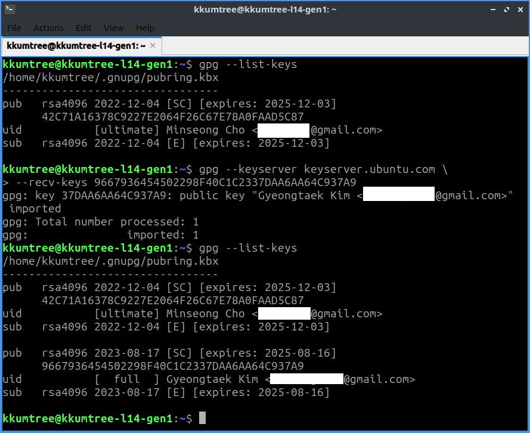

4. 제 노트북에서 두 가지의 파일을 준비하고, 이를 함께 암호화 해보겠습니다.  
   - `yukinet_origin.asc` : 제 서명을 추가한 경택님의 공개키  
     - 이 파일은 `-----PGP PUBLIC KEY BLOCK-----` 블록을 가진,  
       암호화가 안된 공개키 형태가 됩니다.
   - `letter` : (작성 후, 암호화하여 경택님만 읽을 수 있는) 메시지가 담긴 파일  

```bash
# 경택님의 공개키에 제(로컬 서명자) 서명을 추가합니다. 
gpg --local-user <로컬 서명자의 핑거프린트 값> --sign-key <경택님의 핑거프린트 값>

# 서명 대상이 제대로 되었는지 확인하고, `y`를 입력하여 진행합니다.
```

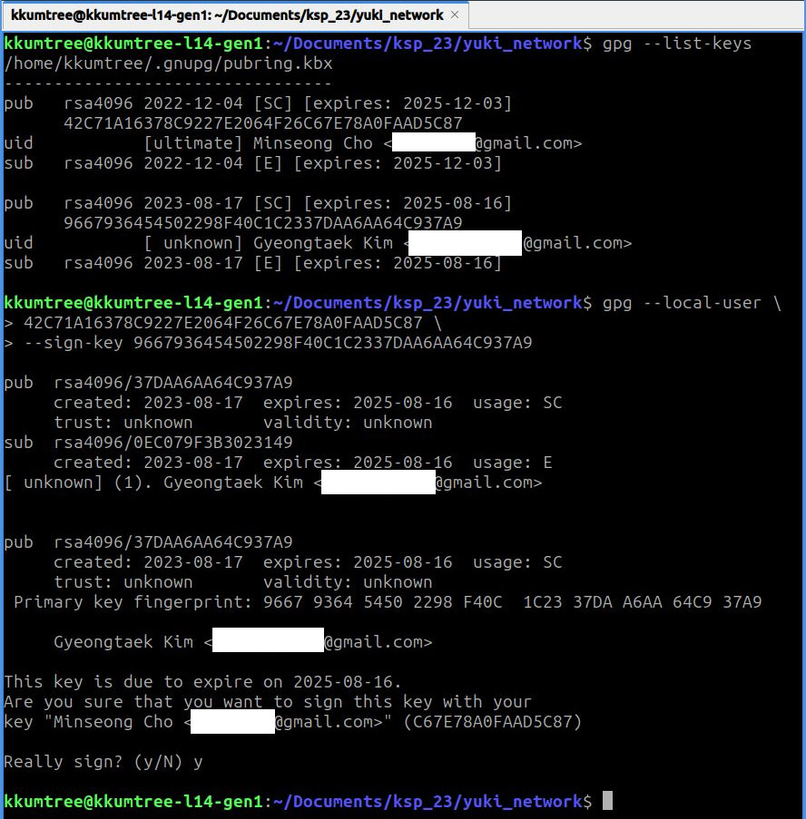

```bash
# 서명이 제대로 되었는지 확인합니다.
# 이 때, 해당 공개키에 로컬 서명자의 서명이 추가되면 성공
gpg --list-sigs <경택님의 핑거프린트 값>
```

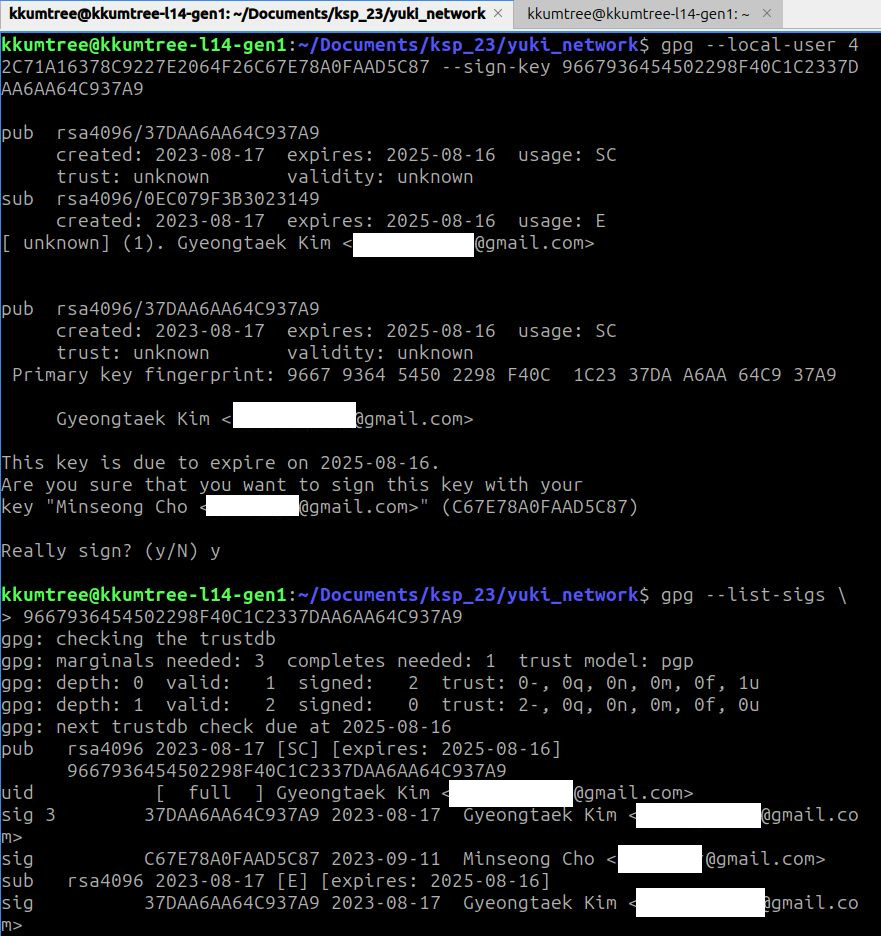

```bash
# 새로운 서명이 첨부된 경택님의 공개키를 내보냅니다. (yukinet_signed.asc)
gpg --armor --output <공개키 블럭을 저장할 텍스트파일이름> --export <경택님의 핑거프린트 값> 

# 메시지를 작성해봅니다. (letter)
# 예시와 같이 stdin으로 작성해도 되고, 
# nano/vim/vscode 등의 에디터를 사용해도 됩니다.
cat << EOF > letter // 이 줄 먼저 입력하고 Enter
> lorem ipsum blablabla Yuki Network LTD!
> Presentation GamSaHapNiDa!
>
> 다음에도 봐요!
>
> EOF
```

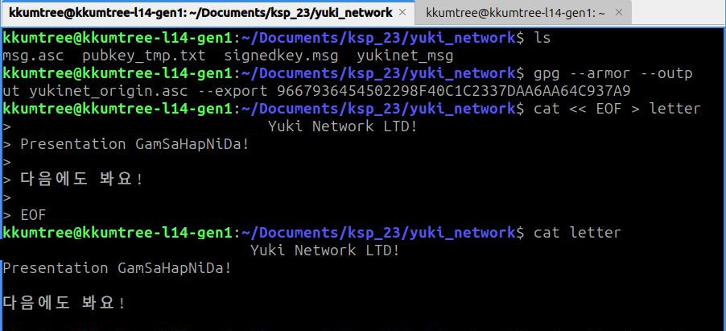

5. 이 두 파일을 하나로 합치고, 경택님의 공개키로 암호화를 한 후, 웹메일에 유첨하여 보내겠습니다.  
   - 메일을 받은 경택님은 제가 보낸 메일에 첨부된 암호화된 msg파일을 받아,  
     키서버 갱신 절차를 진행할 것입니다.  
  
```bash
# 두 파일을 하나로 합칩니다. 

# 방법1: append
#`letter` 파일의 기존 메시지 바로 뒤에 공개키 블럭을 추가합니다.
cat yukinet_signed.asc >> letter

# 방법2: write(overwrite)
# 둘 다 출력하고 새로운 파일을 만듭니다.  
cat letter yukinet_signed.asc > letter_with_signedKey  

# 제대로 합쳐졌는지 확인해봅니다.
# 방법2 를 했을 경우에는 `cat letter_with_signedKey`
cat letter
```

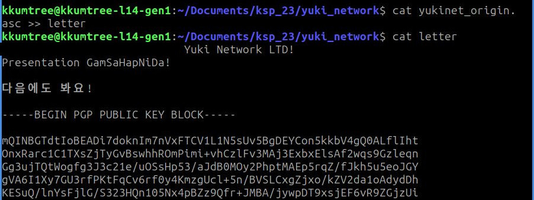

```bash
# 이 파일을 경택님의 공개키로 암호화합니다. 
# `-r`은 `--recipient`의 약자입니다.
cat letter | gpg --encrypt --armor -r <경택님의 핑거프린트 값> --output yukinet-signedBy-mscho.asc

# 암호화가 잘 되었는지 확인합니다.
cat yukinet-signedBy-mscho.asc
```

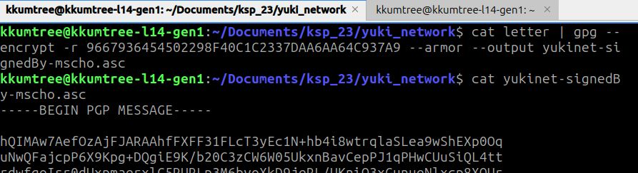

- 이후, 웹메일에 유첨하여 보냅니다.

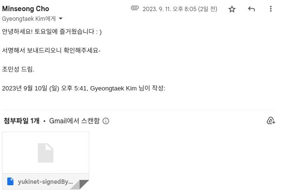

### (3) 상대방이 서명해준 내 공개키 적용하기

- 진행하기에 앞서 상대방의 공개키도 로컬에 저장되어 있어야합니다.  

전송은 끝났으니, 이제 경택님이 메일로 보내준,  
(경택님의 서명이 적용된) 제 공개키를 복호화(decryption)하고 키서버에 올리도록 하겠습니다.  

- 받은 텍스트 파일이 암호화 되지 않은 경우  
  `-----PGP PUBLIC KEY BLOCK-----` 의 블럭을 가집니다.  
  이때는 단순히 아래 명령어를 통해, 전달받은 키를 로컬에 등록하면 됩니다.

```bash
gpg --import <전달받은 공개키 블럭이 담긴 텍스트파일>
```

- 받은 텍스트 파일이 **암호화** 된 경우  
  `-----PGP MESSAGE-----` 블럭을 가집니다.  
  이때는 복호화(decryption)를 하고, 파이프로 로컬에 등록합니다.  

```bash
# (optional) 복호화 결과만 출력하여 확인
gpg --decrypt <전달받은 암호화된 텍스트파일>

# 복호화 결과를 파이프로 로컬에 등록
# 이때 `-----PGP PUBLIC KEY BLOCK-----` 의 블럭을 인지하여 등록합니다.
gpg --decrypt <전달받은 암호화된 텍스트파일> | gpg --import

# (optional) 로컬에 제대로 등록되었는지 확인합니다
gpg --list-sig <로컬에 등록된 본인 핑거프린트 값>
# OR `모든 키 조회`
gpg --list-sigs 
```

   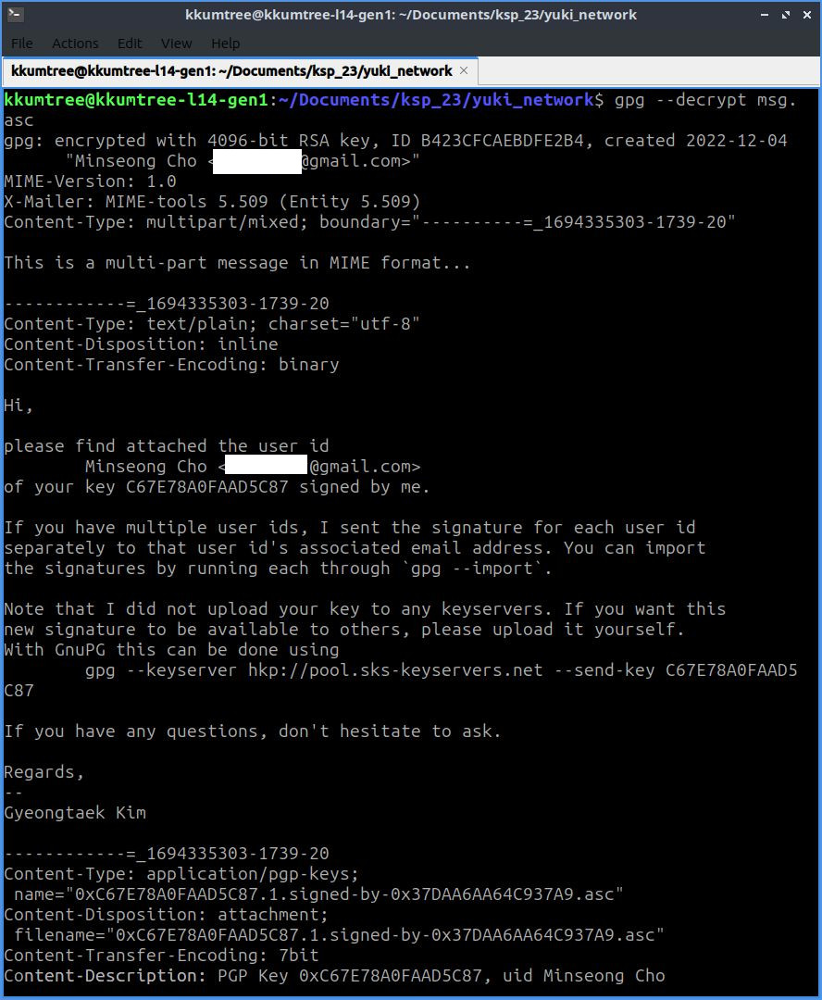

### (4) 우분투 키서버에 업로드

마지막으로 키를 업로드하면 성공입니다.  

```bash
# 키서버에 업로드
gpg --keyserver keyserver.ubuntu.com --send-keys <로컬에 등록된 본인 핑거프린트 값>
```

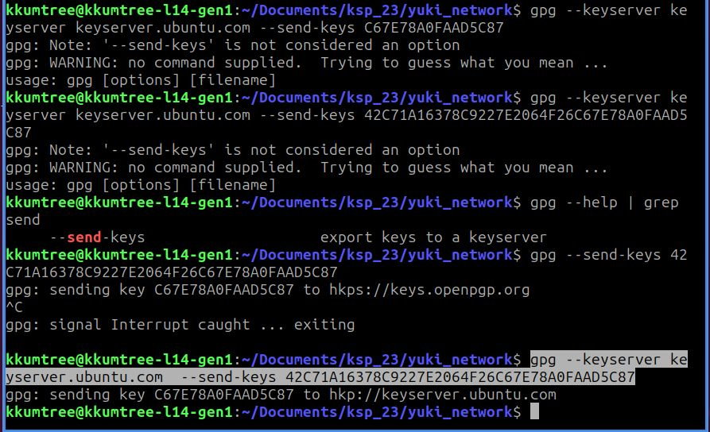

- 키서버 페이지에 본인의 핑거프린트를 입력하면, 내 키에 서명해준 서명자들을 확인할 수 있습니다.

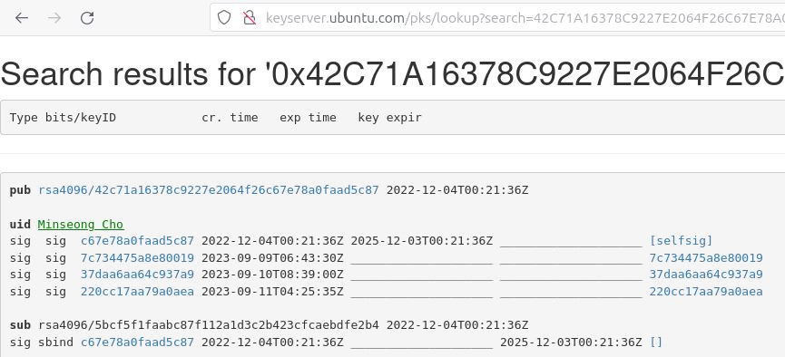

### (FAQ) 서명할 분의 이메일이 여러 개인 경우

이 경우에는 GPG console을 통해 해결할 수 있습니다.

- 아래 예제를 통해,  
  총 3개의 이메일 중에서 먼저 2개를 서명하고, 남은 하나를 마저 서명해보겠습니다.

- 처음에 interative 질의로 y를 누르면 모든 이메일 주소에 서명을 진행합니다.  
  이는 앞서 `(2) 로컬 서명자의 서명하기` 과정과 동일하므르,  
  N을 선택하여 이메일을 선택할 gpg console에 진입합니다.

- 먼저 숫자 2를 입력하여, (2)의 이메일 `xxxx.moe`를 선택했습니다.  
  이후에 숫자 3을 입력하여, (3)의 이메일 `yyyy.org`를 선택했습니다.  
  선택한 이메일들은 `*`로 표시됩니다.
  
   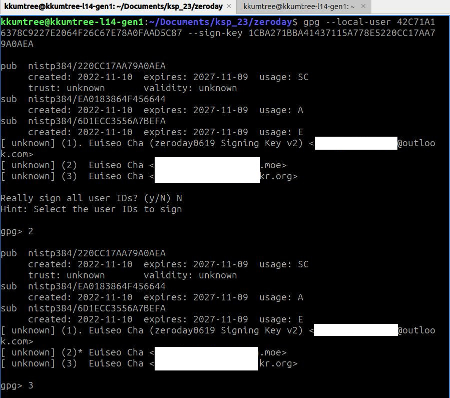

- 잘 선택되었는지 확인하고, 맞으면 `sign`을 입력하고, (아니면 Ctrl+C로 종료합니다)  
  이어서 `y`를 입력하여 서명을 진행합니다. `save`를 입력하면 저장됩니다.  

   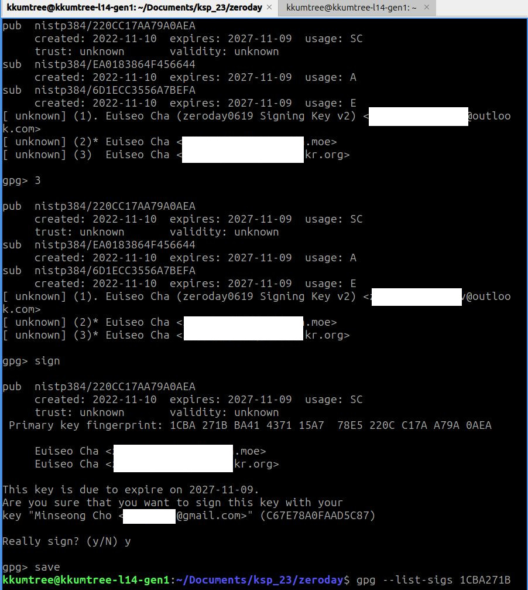

- `gpg --list-sigs`를 통해, 두 개만 서명되었음을 확인할 수 있습니다.

   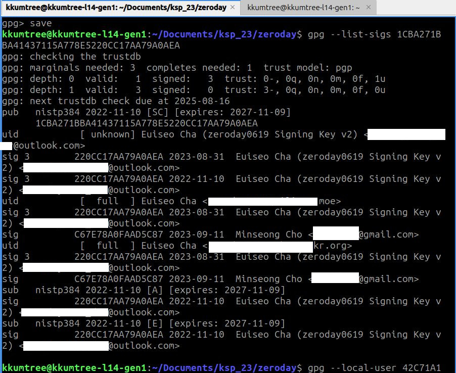

- 서명이 안된 (1)의 이메일도 서명을 진행하면 됩니다. 서명 진입 시,  
  이미 서명된 두 이메일 주소 (1), (2)는 `unknown -> full`로 상태가 변경되었음을 알 수 있습니다.

   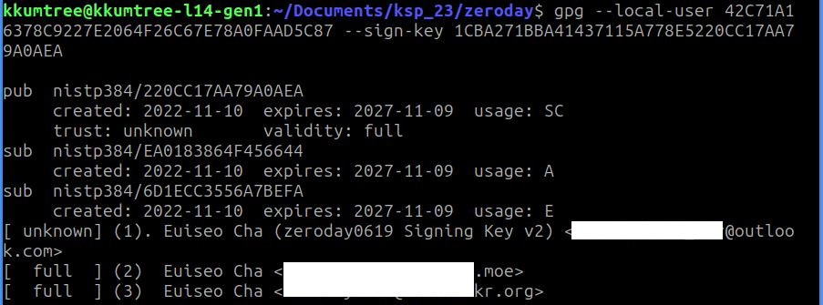

- 세 이메일 주소 모두 로컬 서명이 완료되었습니다.  
  
  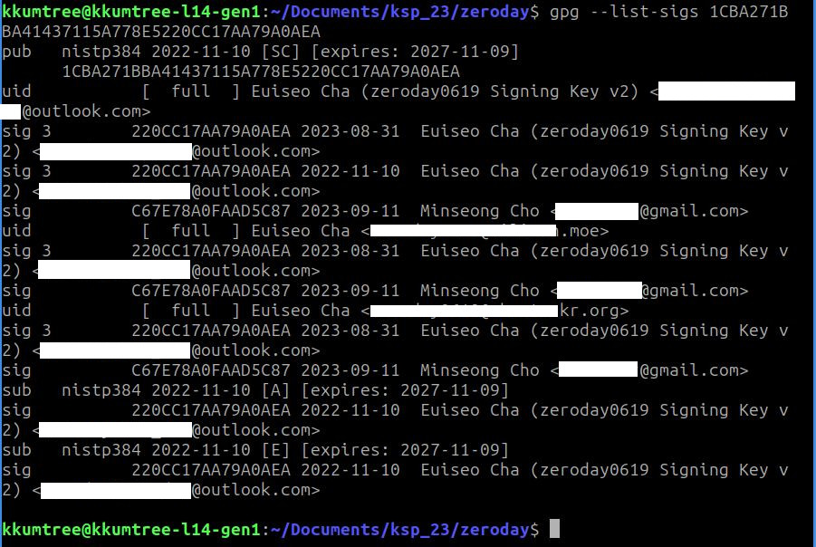

## 4. 마치며

- 이번 글에서는 GPG 명령어를 통해,  
  서명자의 공개키에 서명하고,  
  서명된 공개키를 암호화하여 메시지를 전달하는 방법을 알아보았습니다.

- 본래라면, [MIME type(RFC1341)](https://www.w3.org/Protocols/rfc1341/7_2_Multipart.html)을 통해 메타데이터를 주입하여야 하겠지만,  
  이해를 위해 간이 메시지를 작성하여 암호화하는 방법을 알아보았습니다.  

### '어디에 GPG가 쓰이나요?'

- [Launchpad](https://launchpad.net/)에서는
  CoC(Code of Conduct/행동지침) 서명방법의 기본값을 GPG서명으로 하고 있습니다.
  - [우분투한국커뮤니티 Launchpad](https://launchpad.net/~ubuntu-ko)에서도 이를 확인하고 있습니다. :)  
- GitHub에서도 이메일의 `검증(Verified)`에도 사용된다고 합니다.  
  [44bits](https://www.44bits.io/ko/post/add-signing-key-to-git-commit-by-gpg)를 참고하면 도움이 될 것 같습니다.  

## References

- [Opentutorials/양방향 암호화 방식](https://opentutorials.org/module/5250/29715)  
- [RAON CTF/비대칭키 암호 알고리즘](https://raonctf.com/essential/study/web/asymmetric_key)  
- [UCK23/KSP](https://events.canonical.com/event/32/contributions/310/)  
- [44bits/GPG(GNU PG)를 이용해 git 커밋에 서명하는 방법](https://www.44bits.io/ko/post/add-signing-key-to-git-commit-by-gpg)
