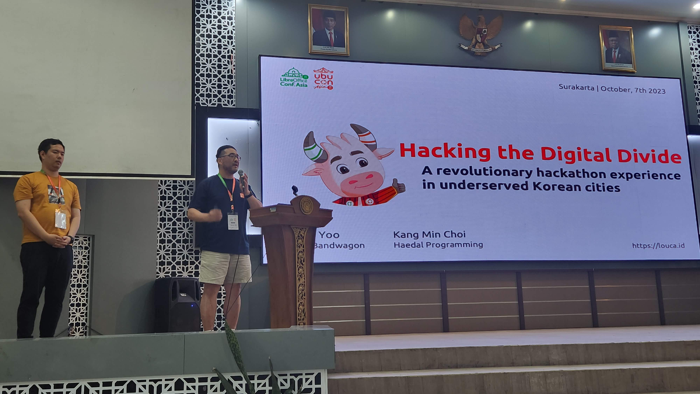
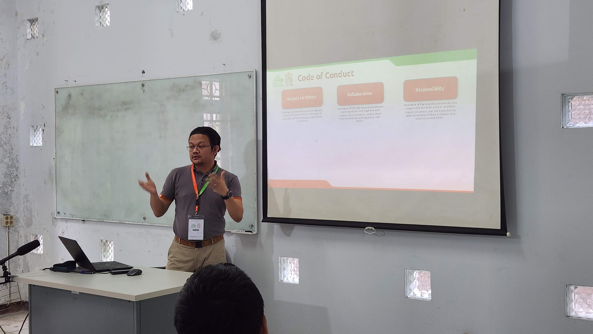

UbuCon Asia, which started as an online event in 2021, is now in its third year. This year's event was held in Surakarta, Indonesia, and was a joint event with LibreOffice Conf Asia, making it a much bigger event than in previous years. I participated in the organizing committee for this year's event as well as last year's, but last year's event was held in Seoul, so I was mainly part of the local team. This year, I was mainly part of the global team, looking for global sponsors to support the event, attending global events such as FOSSASIA and COSCUP to promote UbuCon Asia, and bring international speakers and attendees from various countries to UbuCon Asia.

While last year's event was not easy to organize, this year's event was even more challenging, as it was a large-scale event held in partnership with other communities, it was not easy to coordinate with sponsors, and there were many new challenges compared to last year, such as having to coordinate different preparation methods between the two events, delays in venue confirmation and announcement due to the unexpected Ramadan and Eid periods, and the travel and cancellation of many international speakers. As the event was held in Surakarta, a city we had never heard of before, rather than the capital Jakarta or the larger city of Surabaya, booking flights was also a challenge. However, with a lot of hard work from our local and global teams, this year's event was also a success with a large attendance and a well-rounded program.

## Heading to Surakarta
One of the challenges of this event was probably finding and booking the right transportation to Surakarta. Although Surakarta has an international airport, it is mainly domestic with very few international flights, so i had to go through Jakarta to get to Surakarta Airport. I think the transit was also not easy on this trip. First of all, when I transferred to a domestic flight in Jakarta, I had to go through immigration, retrieve my luggage, and then check-in for my flight with my luggage again at the domestic check-in counter. In addition, since I arrived in Jakarta in the late evening, I could only see the flights for the next morning, so I was worried about how to deal with the long waiting time in between. Luckily, there are a lot of transit hotels inside the Jakarta airport, so I was able to get some sleep before catching my next flight. Because of these issues, I also considered flying to Yogyakarta via Jakarta and taking a train to Surakarta, which would have had a shorter wait and been relatively inexpensive, but I realized that I would be too tired to do that, so I ended up booking a flight to Surakarta.

Luckily, local team organizers picked me up from the Surakarta airport to the hotel, so i was able to arrive at hotel with comfort.

## Day 0 & Day 1
The day before the event, I visited the venue to deliver UbuCon Korea T-shirts to the local team members and to take a quick look at the venue, where necessary equipments are being set-up. The main hall, where the keynote speech would be held, was a multi-purpose auditorium in the UNS school building, while rooms for breakout sessions were various classrooms downstairs, and various facilities necessary for the event were also being set up. I had a chance to met Saputro Arylianto, who I met in Seoul last year, and Yudhi Satrio, who is in charge of the local team this year, and had a quick chat and looked around the venue.

When i got back to the venue at Day 1, The venue looked great with all decorations and equipments were set up. I was able to find a huge sign in front of the building. And was also able to find sponsor booth and a photowall set up inside the venue. The first day was started with opening keynote from Justin Yoo and Kangmin Choi. THey gave their talk on how they tried to solve digital divide between capital area and other cities in Korea through organizing diverse events in Daegu - Such as hackathons. And also shared their experiences on how they tried to automated many things of their large scale event. Many of the audiences listened to their talk with interest. Other sessions included Andika Triwidada's presentation on the status of Ubuntu Indonesian translation, Koo Zhong Zheng's introduction to Juju, and more. 

After all Day 1 program finished, there was a conference dinner for speakers and staff. We gathered at a restaurant nearby and had time for food and chat togather.

## Day 2
Day 2 program was started with talk from Loather K. Backer and Franklin Weng from TDF. There was also an intersting talk for me, A talk delivered by Ubuntu ID veteran. He shared early days activitied of Ubuntu ID with audiences. Unlike past when many Asian Ubuntu LoCo were active, LoCos in Asia are not much active current days. Indonesian LoCo is one of those not active these days. It was great to see the Ubuntu ID veterans respond to the local team's efforts to revitalize the Indonesian community through this session.

I also gave a talk on Day 2. Which was basically a talk for providing information on how local team can submit bid for UbuCon Asia 2024 and other information that local team should know. The original plan was to bring Timor-leste and Indian folk to the stage and hear their idea. But i couldn't bring the Indian folk due to his absence on event. So i could only bring Timor-leste folk to the stage and hear some basic ideas.

I also enjoyed talk delivered by Khairul on Ubuntu Membership topic and Didient's talk on Use Ansible with Ubuntu WSL.

And, of course. There were another conference dinner after day 2 programs. The date of day 2 was also my birthday. I had no idea how they knew my birthday, but local team folks gave me some surprise on celebrating my birthday. I was really glad to them for celebrating me while i've been not much caring my birthday due to my busy days in past few years.

## Day 3 - Group tour
On Day 3, I joined the group tour on Surakarta with event staff and speakers. I visited many great places in Solo including batik factory(Bought a batik shirt for next summer), Surakarta Hadiningrat Palace, Grand Mosque and much more. And had fun time with other folks taking some photos.

## Various sponsors & Sponsorship from Ubuntu Korea Community
Thanksfully we were able to welcome many sponsors for LibreOffice Conf X UbuCon Asia 2023 this year. We welcomed Canonical, The Document Fodundation, Onlyoffice, IndoBSD, Nevacloud, Biznet GioCloud and more sponsors. Gathering sponsors this year was also still challenging. We attended FOSSASIA and COSCUP earlier this year, to meet and talk to companies that might be interested in sponsoring the event and follow up with them afterward, but it was difficult to attract sponsors for the event. The fact that it was a joint event with LibreOffice made the event bigger, but some of the companies that were interested in sponsoring the event wanted to support only one of the two events, so I think that complicated things. Also, in the case of April, there was a delay in securing the venue due to the Ramadan and Eid periods in Indonesia. Next year, I think we need to secure venue much more earlier than now.

This year, Ubuntu Korea Community(Ubuntu Korean LoCo)also joined as a bronze sponsor. There were many reasons for sponsorship: For better travel support for overseas speakers, Earlier UbuCon Korea 2023 was finishied with many financial profit. But the biggist reason was to contribute back to the community that we got from Ubuntu Japanese LoCo back in 2021 when i was organizing the first UbuCon Asia. While Bronze sponsorship may not be a big sponsorship, I and Korean LoCo folks hope it would be helpful for not just running event finances less tight but also for revitalzing the Indonesian LoCo. 

## Concluding the post
So, that was another huge success for the 3rd edition of UbuCon Asia! By organizing a joint event with LibreOffice Conf Asia, It could happen even more bigger scale with more fun. There were a lot of person at the event with 418 attendees and total 528 participants including staff and speakers. While the event was a success, there are some few questions remains for me on how to organize UbuCon Asia better next year. Especially, I think difficulty with raising fund through sponsorship, providing travel support for overseas speakers, small portion of overseas participant would be some big assignment for next years.

Until now, these things have been handled by local team. but after seeing this for 2 years, I now see there's limitation to be handled by local team. Regarding gathering sponsors, For global companies, We have to reach out Asia/APAC office rather than local offices where the event will happen. And for local sponsors, they are frequently interested in local participants rather than overseas participants which makes local team difficult to conveince them. For providing travel support for overseas speakers, I found that local teams could have frequently different practices. So this would also need some standarization. Incrasing portion of foreign speakers is also not a easy thing with just local team's efforts. In the future, I think the global team will have to do a lot of work together to ease the burden on the local team and make a better global event, and think about how to solve the challenges together.

I would like to thank Yudhi Satrio and Saputro Arylianto for their hard work in organizing the event, the local and global team members who participated, and our sponsors for funding the event. The location for next year's event is not yet decided, but hope to have even more fun together next year!