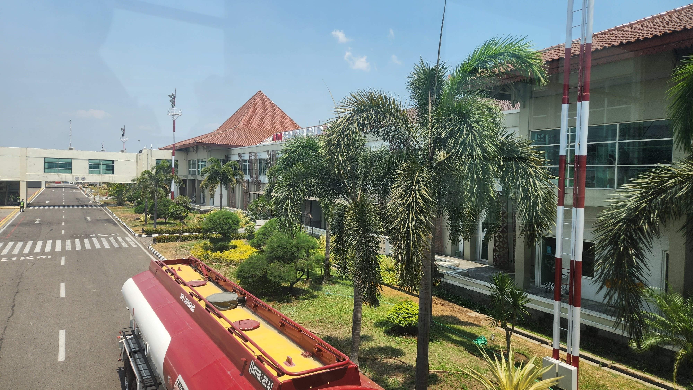
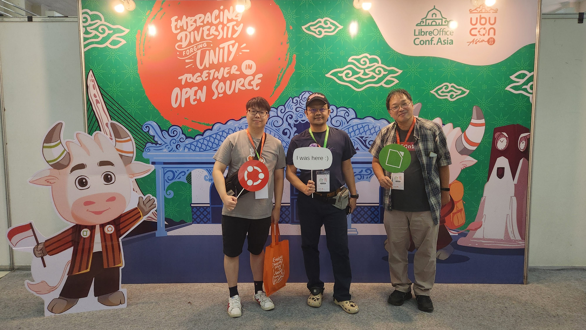
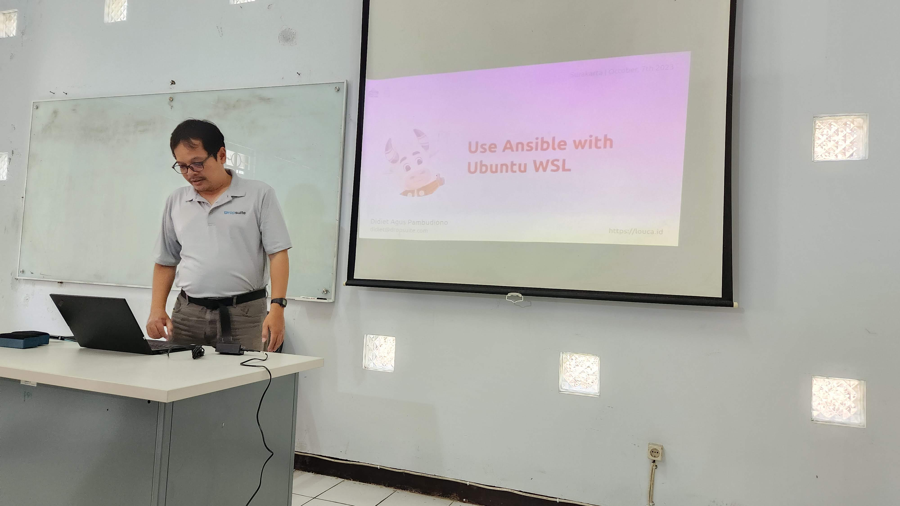
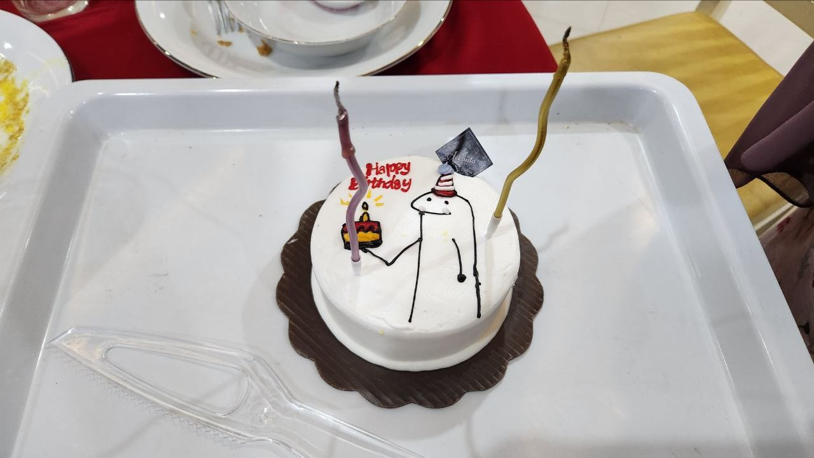

2021년에 온라인 행사로 시작한 UbuCon Asia(우부콘 아시아)가 어느덧 3회차 행사가 되었습니다. 올해 행사는 인도네시아 수라카르타에서 열렸는데요, LibreOffice Conf Asia 행사와 연합 행사로 열려 전년도에 비해 훨씬 더 큰 규모로 행사가 열렸습니다. 저는 작년에 이어 올해 행사에도 준비 위원으로 참여 했는데요, 작년에는 서울에서 열린 행사여서 주로 로컬팀에서 활동 했다면. 올해는 글로벌 팀에서 주로 활동 하면서, 행사를 후원해 줄 글로벌 후원사를 찾거나 FOSSASIA나 COSCUP같은 글로벌 행사에 참석해 UbuCon Asia 를 홍보 하면서 다양한 나라의 해외 연사나 해외 참석자 분들이 UbuCon Asia 를 알고 참석할 수 있도록 하는 역할을 주로 하였습니다.

작년 행사도 준비가 쉽지 않았지만, 올해 행사 준비는 더 도전적이였는데요. 다른 커뮤니티와의 연합으로 여는 대형 행사이다 보니, 후원사와 조율 하기가 쉽지 않기도 했고. 두 행사간 다른 준비 방식을 맞춰야 하고, 사전에 예상치 못한 라마단과 이드 기간으로 인한 행사장 확정 및 공지 지연, 다수 해외 연사 여행 및 발표 취소 등 작년과는 또 다른 새로운 어려움이 많이 있었습니다. 수도인 자카르타나 큰 도시인 수라바야가 아닌 처음 들어보는 수라카르타에서 열리다 보니, 항공편 예약도 쉽지 않았던 것 같네요. 그래도 로컬팀과 글로벌 팀의 많은 노력 속에, 올해 행사 또한 많은 참석자와 다체로운 프로그램과 함께 성공적으로 마칠 수 있었습니다.

## 수라카르타로 이동하기
이번 행사에서 어려웠던 것 중 하나가, 아마 수라카르타로 가는 적당한 교통편 찾아서 예약하기가 아니였나 싶습니다. 수라카르타에는 국제공항이 있긴 하지만, 국제선이 거의 없어 국내선 위주로 운영되는 편이고, 때문에 자카르타를 경유해야 수라카르타 공항에 도착이 가능했습니다. 이번 여행은 경유 하면서 환승이 쉽지가 않았던 것 같습니다. 우선 자카르타에서 국내선으로 환승하면, 입국심사를 통과하고 수하물을 찾은 다음 국내선 체크인 카운터에서 다시 탑승 수속과 수하물 수속을 해야 하는 쉽지 않은 과정이 있었고. 거기다가 늦은 저녁에 자카르타에 도착해서, 다음날 아침 비행기를 타는 항공편 정도만 보여서 중간에 긴 대기 시간을 어떻게 해야 하는지에 대한 고민도 많이 한 것 같네요. 찾아보니 다행이도, 자카르타 공항 내부에 환승 호텔이 많이 있어서 이를 활용해서 잠을 자고 다음 비행기를 탈 수 있긴 했습니다. 이러한 문제 때문에 대기시간도 비교적 더 짧고, 가격도 비교적 저렴한 자카르타 경유 족자카르타행 비행기를 타고, 수라카르타까지 기차를 타 볼까 했으나. 그렇게 까지 하면 너무 피곤할 거 같아서 결국 수라카르타로 가는 항공편을 예약해서 다녀 왔습니다.

다행이도 수라카르타 공항에서 호텔 까지는 현지 로컬팀 오거나이저 분들께서 발표자 대상으로 픽업을 해 주셔서 편안하게 도착할 수 있었습니다.

## 행사 전날과 1일차 일정
행사 전날에는, 로컬팀 분들께 UbuCon Korea 티셔츠도 전달 드리는 겸 시설물 설치가 진행 중인 행사장도 잠깐 구경하러 행사 장소에 방문 했습니다. 기조연설 등이 진행될 메인 홀은 UNS 학교 건물의 다목적 강당을 활용하고, 그 외 Breakout session 은 아래층의 여러 강의실을 활용하는 형태였고, 한창 행사에 필요한 각종 시설물이 설치 되고 있었습니다. 작년에 서울에서 뵈었던 Saputro Arylianto 님과 올해 로컬팀 총괄 중이신 Yudhi Satrio님을 뵙고 잠시 인사 나누면서 행사장을 둘러보는 시간을 가졌습니다.

행사날에 다시 방문하니, 어느세 시설물이 모두 설치되어 화려해진 행사장을 만나볼 수 있었습니다. 건물 입구부터 큰 간판은 물론, 행사장에 들어가자 전날 횡했던 것과 달리 후원사 부스와 포토월 등이 설치되어 다양한 콘텐츠로 가득 찬 모습이였습니다. 첫날 오프닝 키노트는 유저스틴님과 최강민님의 강연으로 시작 되었습니다. 대구에서 커뮤니티 활동을 하시면서 수도권과 다른 지역건 정보격차 해소나, 해커톤 등의 큰 행사 운영 자동화에 대한 고민을 공유 해 주셨고. 참석하신 많은 분들이 흥미롭게 경청 해 주셨습니다. 그 외에도 Andika Triwidada 님의 우분투 인도네시아어 번역 현황, Koo Zhong Zheng 님의 Juju 소개 등 다양한 세션이 진행 되었습니다.

1일차 일정 후에는, 발표자와 행사 관계자분들을 위한 컨퍼런스 저녁만찬이 열렸습니다. 행사장 근처의 식당에 모여서 다같이 식사를 하며 이야기를 나누는 시간을 가졌습니다.

## 2일차 일정
2일자체는 TDF에서 LibreOffice 관련 활동을 하시는 Loather K. Backer 님과 Franklin Weng 님의 세션으로 행사가 시작 되었고. 흥미로운 세션이 하나 있었는데, 우분투 인도네시아 로컬 커뮤니티의 초창기 원로 운영진 분께서 강연을 해 주셨습니다. 초창기에 어떤 활동을 했는지, 어떤 분들이 활동에 참여 했는지 대략적으로 알 수 있었습니다. 아시아 지역의 우분투 로컬 커뮤니티가 과거에는 많이 활발했지만, 지금은 그렇지 않은 곳이 많은데 우분투 인도네시아 커뮤니티가 그런 곳 중 하나입니다. 이번에 이 세션을 통해 또 인도네시아 커뮤니티를 다시 활성화 하고자 하는 로컬팀의 노력에 원로 운영진 분들이 호응하는 모습을 볼 수 있어 좋았습니다.

이 날에 저도 간단히 세션을 하나 진행 했는데요, 내년 2024년에 UbuCon Asia를 개최하려면 무엇을 준비해야 하는지에 대해 소개하고 개최에 관심 있는 팀을 초대해서 간단히 논의 해 보는 세션을 진행 했습니다. 동티모르와 인도쪽 커뮤니티에서 관심이 있다고 해서, 원래는 두 커뮤니티에서 한 분씩 나와서 간단히 발표를 진행 하기로 했으나, 아쉽게도 인도측 발표자분은 개인 사정으로 오시지 못해서 동티모르측 발표만 볼 수 있었습니다.

그 외에, Khairul님의 Ubuntu Membership 에 대한 세션과 Didiet님의 Use Ansible with Ubuntu WSL세션에도 흥미롭게 들었습니다.

이 날에도 컨퍼런스 일정 후에, 컨퍼런스 저녁만찬이 다른 식당에서 있었는데요. 이 날은 또 저의 생일이기도 했는데, 다들 어떻게 알았는데 깜짝 생일 축하를 해 주어서 정말 즐거웠던 날 이였습니다. 최근 몇년간 바쁘게 살다 보니 생일 따로 신경 안 쓰고 그냥 지나가곤 했는데, 로컬팀 분들꼐서 또 멀리서 온 저에게까지 생일 챙겨주셔서 정말 감사했습니다.

## 3일차 그룹 투어
3일차에는 컨퍼런스 관계자와 발표자분들이 모여 수라카르타 그룹투어를 하는 시간을 가졌습니다. 바틱 수제 공예를 하는 곳을 방문 하기도 했고(방문 한 김에 여름에 입을 바틱 셔츠도 하나 구입 했습니다), 수라카르타 하디닌그라트 궁전, 그랜드 모스크 등 수라카르타의 여러 명소를 방문하고 사진도 촬영하면서 즐거운 시간을 보냈습니다.

## 다양한 후원사와 우분투한국커뮤니티의 후원사 참여
올해 LibreOffice Conf X UbuCon Asia 2023에도 감사하게도 많은 후원사에서 참여 해 주셨습니다. Canonical과 TDF(The Document Foundation)부터 Onlyoffice, IndoBSD, Nevacloud, Biznet GioCloud등 여러 후원사에서 참여 해 주셨는데요. 올해도 역시 후원사 모집이 쉽지는 않았습니다. 올해 먼저 열렸던 FOSSASIA와 COSCUP에 참여하며 후원에 관심이 있을 만한 회사 담당자를 만나 이야기도 나누고 이후 후속 연락도 드리는 등 많은 노력을 했지만, 행사에 후원사로 유치 하기는 어려웠습니다. LibreOffice와 연합 행사여서 행사 규모가 더 커지긴 했지만, 후원에 관심 있는 회사 측에서는 두 행사 중 하나만 지원하고 싶어하는 경우도 있다 보니 이런 면에서 복잡해 진 것도 있는 것 같습니다. 또, 4월의 경우 인도네시아에서는 라마단과 이드 기간 때문에 행사장 확보가 지연 된 것이 원인이 되기도 하였습니다. 내년에는 지금보다 더 일찍 장소 확보가 필요하다는 생각이 듭니다.

이번 행사에는 우분투한국커뮤니티에서도 브론즈 후원사로 참여 하였습니다. 비용이 많이 발생하는 해외 연사분들 여행 지원을 좀 더 도움이 되고자 하거나, 한 달 전에 진행한 UbuCon Korea 2023 행사를 흑자 재정으로 마친 등 여러 이유가 있었지만, 가장 큰 이유는 2021년에 첫 UbuCon Asia를 개최하며 우분투 일본 커뮤니티에서 많은 금액을 후원 해 주었었고, 이렇게 받은 도움을 커뮤니티에 되돌려 주고자 하는 것 이였습니다. 브론즈 등급이라는 그다지 크지 않은 등급으로 참여 했지만, 이번 후원이 행사 재정 뿐만 아니라 인도네시아 지역 우분투 커뮤니티에 많은 도움이 되길 바랍니다.

## 글을 마치며
이렇게 어느세 세번째 UbuCon Asia가 성공적으로 끝났습니다! 올해는 또 LibreOffice Conf Asia 와 연랍으로 개최 하면서 더 큰 규모로 열 수 있어 더 즐겁기도 했는데요. 참가자만 418명, 발표자와 자원봉사자 등 행사 관계자도 포함하면 528명으로 정말 많은 분들꼐서 참여 해 주셨습니다! 행사가 성공적으로 끝난 이면에는 어떻게 하면 다 나은 UbuCon Asia를 내년에 개최할 수 있을까에 대한 고민이 남습니다. 특히 후원사 모집을 통한 자금 조달이 어려운 점이나, 해외연사 여행 지원, 행사의 해외 참가자 비중이 적은 점은 앞으로도 큰 과제 중 하나가 될 것 같습니다.

지금까지는 이러한 부분을 UbuCon Asia 로컬 팀에서 모두 다 처리 해 왔으나, 2년간 그렇게 해 보니 로컬팀이 이를 직접 다 처리 하기에는 많은 한계가 보입니다. 아시아 대륙 단위 행사이다 보니, 글로벌 기업인 경우 현지 지사보다는 Asia/APAC 본사에 연락해 보아야 하거나 로컬 후원사의 경우 해외 참가자 보단 국내 참가자에 관심이 많아 로컬팀이 나서서 후원사를 설득하고 유치 하기에는 어려움이 있는 경우가 자주 있습니다. 해외 연사 여행 지원의 경우, 나라별 로컬 커뮤니티마다 방식에 차이가 있다 보니 추후 논의를 통해 어느정도 표준화가 필요하고, 해외 참가자 비중을 늘리는 것 또한 로컬팀의 노력 만으로는 쉽지 않죠. 앞으로는 로컬 팀의 부담을 완화하고 더 좋은 글로벌 행사를 열기 위해 글로벌 팀이 함께 많은 노력을 하고 과제를 어떻게 해결 해 나가야 할지 함께 고민 해 봐야 할 것 같습니다.

행사 준비로 고생하신 Yudhi Satrio님과 Saputro Arylianto님께 감사 드리며, 함께한 로컬팀과 글로벌 팀 멤버분들. 그리고 행사에 필요한 자금을 지원 해 주신 후원사측 분들께도 감사 드립니다. 내년 행사 개최지는 아직 정해지지 않았지만, 내년에도 함께 더 즐거운 행사를 열 수 있었으면 좋겠습니다!