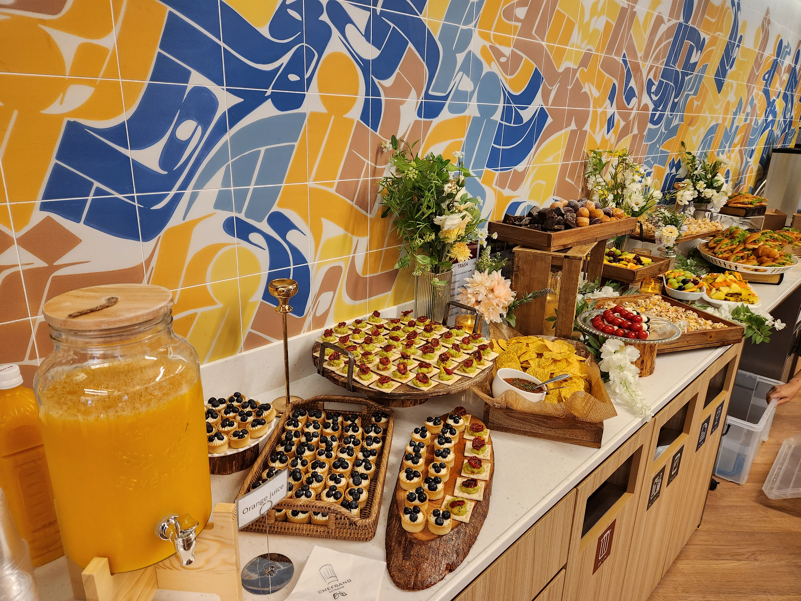

행사에 참석 해 주신 참석자 분들과, 후원사, 행사 준비위원 및 자원봉사자 그리고 좋은 주제로 발표를 해 주신 연사분들 덕에, 지난 9월 9일 한국마이크로소프트에서 열렸던 UbuCon Korea 2023이 성공적으로 종료 되었습니다. 이번 행사는 작년에 개최 되었던 UbuCon Asia 2022의 스핀오프로 준비 되었으며, “개발자 생산성을 위한 우분투”를 테마로 하여 여러 흥미로운 발표 제안서를 받아 프로그램이 구성 되었습니다. 

# 행사 준비 활동
이번 행사는 5월 말 부터 준비위원회가 조직되어 준비를 위한 활동이 시작 되었습니다. 한영빈, 배준현, 정규석, 한상곤, 조민성, 문준상, 방기연, 추영욱, 정회형, 윤정민 등 총 10명의 준비위원이 참여 하였습니다. 격주 미팅을 통해 각자 맡은 일감의 업데이트를 공유하고, 새로운 일감을 분배하는 형태로 행사 준비가 진행 되었습니다. 

# 장소
올해 행사는 한국마이크로스프트측에서 13층 행사장을 후원 해 주신 덕에, 행사장 대관 비용 지출이 없어, 이 부분에서 행사 개최 비용을 크게 절약할 수 있었습니다. 종로에 위치 해 있으면서도, 종각역(1호선), 광화문역(5호선), 안국역(3호선)이 인접하여 접근성 또한 좋은 위치여서 참석자 분들이 오시기에도 좋았습니다. 
행사장 리셉션은 키오스크와 참가자 분들이 수령할 기념품을 비치하여 등록 데스크로, 강연장 출입문 앞 라운지 공간은 후원사 부스와 케이터링 공간으로 활용 되었습니다. 강연장의 경우 150석 규모로, 중간에 가벽이 있어 일정 및 세션 유형에 따라 유연한 운영이 가능 했습니다. 개회사와 기조연설 및 폐회사 진행시는 가벽을 접어서 방 분리 없이 운영하고, 이외 시간에는 가벽을 이용해 분리하여 강연 세션 및 워크샵 세션을 동시 운영 하였습니다.

# 마케팅, 기념품, 케이터링
이번 행사는 작년에 비해 좀 더 다양한 방법으로 행사에 대한 홍보 활동을 진행 하였습니다. 기존에 진행했던 소셜미디어 채널을 통한 마케팅과 Facebook, Instagram 광고 캠페인도 진행 되었으며. GopherCon KR, PyCon KR, OpenInfra Days KR 등 다른 오픈소스 커뮤니티의 행사를 통한 홍보 활동도 진행 되었습니다. 이벤터스측에서 지원해 준 이벤트 노출 광고 또한 활용 하였으며, 이를 통해 많은 참석자를 성공적으로 모을 수 있었습니다.

기념품으로는 기능성 티셔츠와 스티커 그리고 발표자 및 행사 관계자 대상으로 슬리퍼가 추가로 증정 되었습니다. 기능성 티셔츠의 경우, 9월임에도 더운 날씨에 알맞아 많은 참석자 분들께서 좋은 반응을 보내 주셨고, 슬리퍼와 스티커 또한 좋은 반응을 보내 주셨습니다. 행사 종료 후 남은 기념품은 이후 다른 행사에서 증정 하거나, 해외 우분투 커뮤니티 운영진 분들께 선물로 드리는 형태로 활용 되었습니다.

올해는 작년과 달리 행사 장소 여견이 되어, 참가자 분들을 대상으로 케이터링을 제공 해 드릴 수 있었습니다. 작은 샌드위치, 과일 꼬치, 나초, 까나페 등 간단히 먹을 수 있는 핑거푸드 위주로 준비되어 제공이 되었습니다. 케이터링의 경우 인기가 많다 보니 예상보다 빠르게 준비된 음식이 모두 소진 되기도 하였습니다. 이러한 경우를 고려하여, 발표자와 관계자 대상으로는 핑거푸드 도시락을 별도로 준비 하여 제공 해 드렸습니다. 

# 참여자

올해 UbuCon Korea 에는 총 165명이 참가 등록 하였으며, 그 중 151명이 현장 체크인 하는 높은 참여율을 달성 하였습니다. 참가하신 분들 중 32.8%가 학생(대학생 29.2%, 중/고등학생 3.6%) 였으며, 무응답 6.5%와 커뮤니티 운영진 6%를 제외한 나머지 다수는 현업에 종사 하시는 분들께서 참석해 주셨습니다. 38.8%의 참석자가 IT관련 직종 종사자 였으며, DevOps Engineer, System Engineer, Software Engineer, Cloud Engineer, Solution Architect로 근무 하시는 분들께서 주로 참석해 주셨습니다. 이 외에 Sales Manager, 마케터로 종사 하시는 분들도 조금씩 참여해 주셨으며, 소수의 기업 임원 분들께서도 참석해 주셨습니다.

# 회계
올해 행사의 예산은 작년 UbuCon Asia 2022 에 비해 약 ¼ 수준으로 구성되어 행사 운영에 사용 되었습니다. 우선 행사 참석자 인원 규모를 작년에 목표로 했던 300명에서 절반 이하인 130명 정도로 설정하고, 행사 기간 또한 2일에서 1일로 축소하였기 때문에 작년에 비에 크게 축소된 예산으로도 행사 운영에 큰 문제가 없었습니다.

올해는 행사 규모를 축소 한 대신, 작년 UbuCon Asia를 개최하며 아쉬웠던 부분을 개선하기 위해 많은 노력을 기울였습니다. 참석자분들이 사진을 촬영할 수 있는 포토월 개선, 지난 해 제공하지 못한 케이터링 또한 참가자 대상으로 제공 되었으며. 행사에 참석하는 모든 사람들을 위한 안전을 위해 주최자 책임보험 및 준비위원과 자원봉사자 대상 여행자보험 가입도 진행 되었습니다.  

2021~2022년에 UbuCon Asia에 참여했던 [Canonical](https://ubuntu.com/), [Microsoft Korea](https://azure.microsoft.com/ko-kr/solutions/linux-on-azure/ubuntu/), [정보통신산업진흥원](https://oss.kr), [클라우드메이트](https://cloudmt.co.kr/), [그로메트릭](http://www.grometric.kr/) 등 많은 후원사에서 감사하게도 올해 UbuCon Korea 에도 다시 한번 후원사로 참여 해 주셨습니다. 새롭게 후원사로 참여 해 주신 [OSC Korea](https://www.osckorea.com/)와 [이벤터스](https://event-us.kr/) 측에서도 UbuCon Korea의 성공적인 개최를 위해 많은 힘을 써 주셨습니다. 행사 개최에 많은 도움을 주신 후원사측에 다시한번 감사 드립니다.

이번 행사를 마치고 남은 이익의 일부는 올해 인도네시아 수라카르타에서 열렸던 [LibreOffice Conf X UbuCon Asia 2023](https://louca.id/) 행사에 브론즈 후원사로 참여 하는데 사용 되었습니다. 해당 행사에 후원 된 금액은 해외 연사 여행 경비 지원에 우선적으로 사용 되었으며, 아시아 지역 528명 이상의 참석자와 함께 행사가 성공적으로 개최 되었습니다. 

## 수입

| 항목 | 금액(단위: 원) |
| --- | --- |
| 티켓 수입(개인후원 포함) | ₩3,503,133 |
| 후원사 모집 | ₩17,322,665 |
| 합계 | ₩20,825,798 |

## 지출

| 항목 | 금액(단위: 원) |
| --- | --- |
| 기념품(티셔츠, 스티커, 명찰, 슬리퍼 등) | ₩2,481,960 |
| 마케팅(소셜미디어 광고 등) | ₩245,962 |
| 보험(주최자 책임보험, 관계자 대상 여행자보험) | ₩194,030 |
| 소모품(생수, 테이프, 쇼케이스 등) | ₩95,800 |
| 시설물(배너, 후원사 부스, 포토월 등) | ₩2,067,340 |
| 관계자 여비교통비(숙박) | ₩440,000 |
| 해외연사 여비교통비(숙박 및 항공권) | ₩2,687,500 |
| 점심 도시락 및 케이터링 식비 | ₩1,524,000 |
| 관계자 및 연사 저녁만찬 식비 | ₩1,563,000 |
| 행사 전날 준비 참여 관계자 식비 | ₩96,300 |
| UbuCon Asia 2023 후원 및 거래수수료 | ₩1,846,145 |
| OPDC 수수료 | ₩493,000 |
| 합계 | ₩13,731,03 |

 
## 결산

| 항목 | 금액(단위: 원) |
| --- | --- |
| 수입 | ₩20,825,798 |
| 지출 | ₩13,731,037 |
| 잔액 | ₩7,094,761 |

# 내년에는?
UbuCon Korea는 내년에도 열립니다! 올해와 동일한 규모와 예산으로, 동일한 장소에서 개최될 예정이며, 2024년 8월 10일에 개최 하고자 합니다. 내년 행사 장소는 아직 확보 되지는 않은 상태이며, 확보가 완료되는 데로 후원사 모집과 발표 제안서 모집이 시작 될 예정입니다. 이에 대해 먼저 안내 받고 싶다면, contact@ubuntu-kr.org 로 문의 해 주시면 추후 안내드릴 수 있도록 하겠습니다!

내년에는 부산에서 연례 데비안 커뮤니티의 컨퍼런스인 [DebConf24](https://wiki.debian.org/DebConf/24) 또한 개최될 예정입니다. 7월 21부터 8월 4일 까지 (DebCamp 1주, 이후 DebConf 1주 일정) 부경대에서 열릴 예정이며. 우분투는 데비안에 뿌리를 두고 있기도 한 만큼, 다수의 우분투한국커뮤니티 운영진 분들도 Debian Korea에서 이끄는 로컬팀에 참여하여 행사 준비를 도울 예정입니다. DebConf24에도 많은 관심 부탁드리겠습니다!
