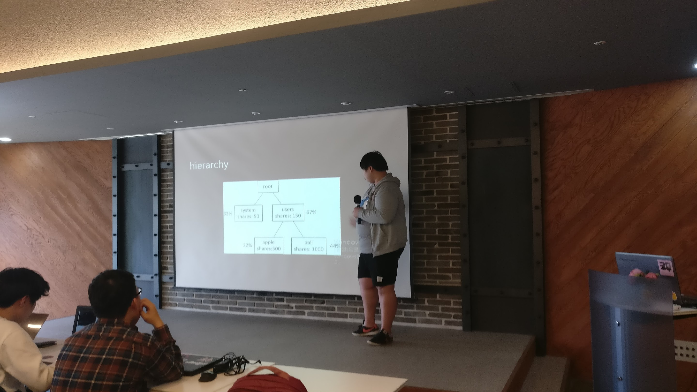
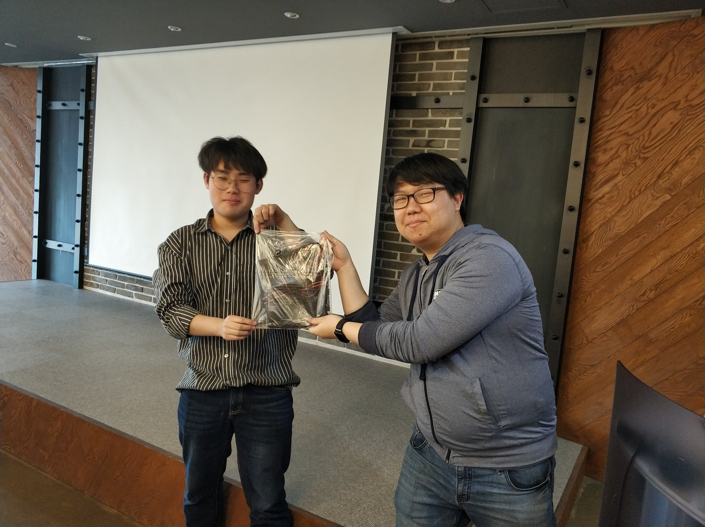

4.28 토요일 부터, 4.29 일요일 까지. 우분투 18.04 릴리즈 파티를 준비하여 진행 하였습니다. 이번 LTS 버전 출시기념 릴리즈 파티 행사는, 서울 뿐만이 아닌 다른 지역에서도 공식적으로 진행되어 이전에 진행되었던 릴리즈 파티 행사와는 또 다른 의미를 가지게 되었습니다. 서울 외에, 대전과 부산에서 진행 되었으며. 세 행사 모두 성공적으로 마무리 되었습니다.

## 서울
선릉역 근처에 위치한 [D.CAMP](http://loco.ubuntu.com/events/venues/Korea_Republic_of/1358/detail/)에서 행사가 진행되었습니다.
["코딩이랑 무관합니다만,"](https://fb.com/groups/System.out.Coding)이라는 페이스북 기반의 커뮤니티화 함께 행사를 준비하였습니다.
다른 세미나 행사와는 또 달리, LTS 출시 기념을 위한 행사이다 보니 60~70명 정도의 평소와 비교하면 정말 많은분들께서 참석해 주셨습니다.
행사에서는 새 LTS 버전에서 달라진 점에 대해서 알아보는 시간도 가지고, 그 외에 아래와 같은 주제로도 이야기 해 보는 시간을 가졌습니다.

- 미세먼지 같은 우분투 서버 활용 팁.
- 우분투 18.04 LTS 의 새로운 점.
- VM 이랑 무관한 컨테이너 이야기.
- 1분기 C++ 기초 스터디 결과 발표.
- Hanjp-IM 프로젝트 소개와 진행 현황 발표.

발표 세션을 모두 마친 후에는, 사전에 공동구매를 통해 우분투 18.04 기념 티셔츠를 주문한 분들께 티셔츠를 드렸고,
캐노니컬(Canonical) 에서 지원해 준 각종 우분투 굿즈가 든 LoCo 컨퍼런스 팩에서 일부 기념품을 추첨하여 증정해 드렸습니다.

Ubuntu 18.04 LTS Release Party @ Seoul 행사에서의 사진은 [여기](https://photos.google.com/share/AF1QipNMgfSMrZCO2yRBRltgb34L3Z-nnm5lSd2L1xxKGGpoeh-aFdFOKqA0_0CUL4t0Mw?key=SWhuOUVIZXQ2YjNha3VycG5KZTBVMm5yc3ZjWXN3) 에서 더 보실 수 있습니다.

## 대전

대전 지역에서는, [사회적자본지원센터](http://loco.ubuntu.com/events/venues/Korea_Republic_of/1359/detail/) 에서 포틀럭 파티(참여자 각자가 나눠먹을 음식을 가져오는)형태로 릴리즈 파티 행사를 진행 했습니다.
LTS 버전 출시 기념을 위해 약 15~20분 께서 행사에 참석해 주셨습니다.
포틀럭 파티 였기 떄문에, 각자가 음식을 가져와 나눠먹으며 이야기를 나누를 형태로 행사를 진행 하였습니다.
주로 우분투 18.04 의 변경된 점에 대한 이야기를 하였고, 그 외에 그놈(GNOME) 메모리 누수 이슈와, 앞으로의 대전 지역팀 활동 계획에 대해서도 이야기 하는 시간을 가졌습니다.
대전 행사에서도 마찬가지로, 사전에 기념 티셔츠 신청하신 분들꼐 티셔츠를 드리고, LoCo 컨퍼런스팩 기념품 일부를 추첨을 통해 증정 했습니다.

Ubuntu 18.04 Release Party @ Daejeon 행사에서의 사진은 [여기](https://photos.google.com/share/AF1QipMwJ7KZpwyNbdI85OWQyerwrxxrq-pAeZmhktySoG9ZYYrzGk5jqovAMaDYe3B20g?key=bi02VXBoeGJpVERQOVJMX21xQzR1WEt6anVPS0hR)에서 더 보실 수 있습니다.

## 부산

부산 지역에서는, 작은 티타임 형태로 [패스파인더](http://loco.ubuntu.com/events/venues/Korea_Republic_of/1360/detail/)에서 행사가 진행 되었습니다. 약 7~10 분께서 참석해 주셨습니다.

부산 행사의 경우는 새 LTS 출시에 대해 예기로 하고, 노트북에 새 우분투 버전을 직접 설치 시도도 해 봤습니다.
이야기를 잠깐 나누면서 차 한잔 한 다음, 마찬가지로 공동구매 신청하신 분들꼐 기념 티셔츠 드리고, LoCo 컨퍼런스팩 기념품 일부도 증정 했습니다.
부산 행사의 경우는 부산 쪽에서 여신 분께서 사진을 찍지 못하셔서, 사진이 한장밖에 없습니다. 양해 바랍니다.

[여기](https://photos.app.goo.gl/Sz3ik2utjHwKK9He2)에서 부산 행사 사진을 보실 수 있습니다.

## 링크
- [Ubuntu 18.04 LTS Release Party @ Seoul](http://loco.ubuntu.com/events/ubuntu-ko/3729-ubuntu-1804-lts-release-party-seoul/)
- [Ubuntu 18.04 LTS Release Party @ Busan](http://loco.ubuntu.com/events/ubuntu-ko/3733-ubuntu-1804-lts-release-party-busan/)
- [Ubuntu 18.04 LTS Release Party @ Daejeon](http://loco.ubuntu.com/events/ubuntu-ko/3730-ubuntu-1804-lts-release-party-daejeon/)