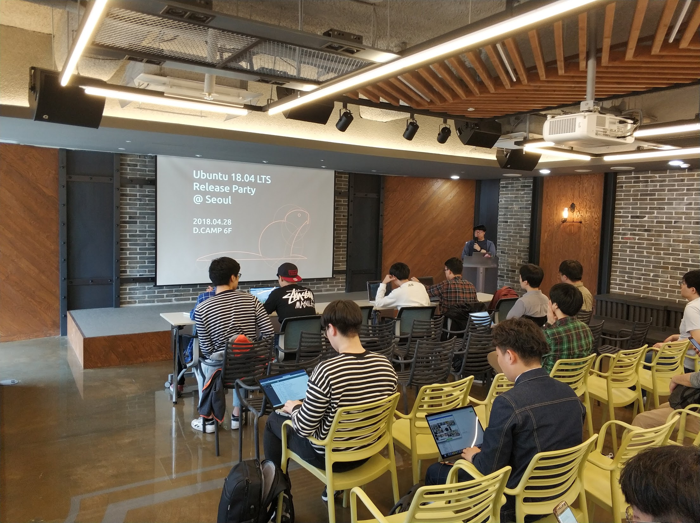
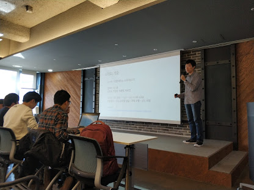
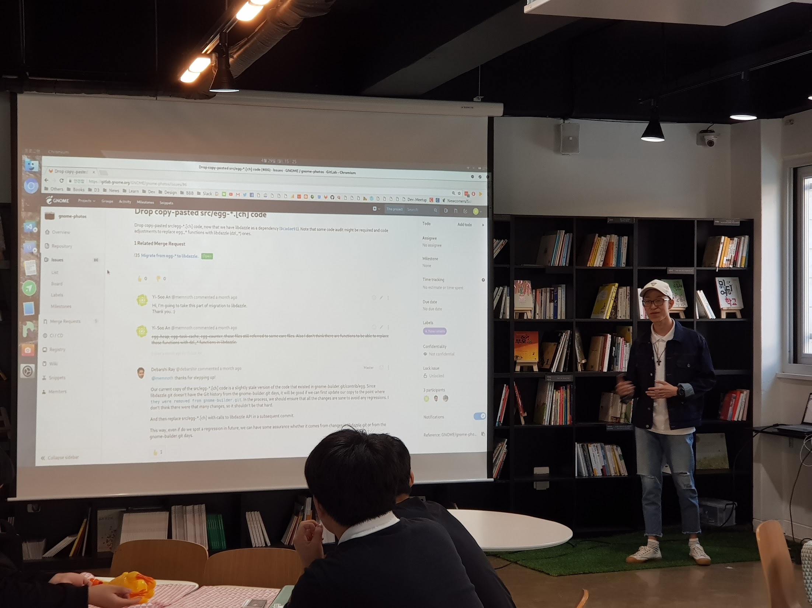

Last weekend, We hosted Ubuntu 18.04 LTS Release Party in 3 different cities.
We hosted event on Saturday at Seoul and Busan, and on Sunday at Daejeon. All event were ended successfully.

## Seoul
At Seoul, It was held at [D.CAMP](http://loco.ubuntu.com/events/venues/Korea_Republic_of/1358/detail/) near Seolleung station.
The event was co-hosted with ["Well, It's not related to coding"](https://fb.com/groups/System.out.Coding)
About 60~70 people attended to celebrate the release of new LTS version.
We talked about changes in the new LTS release and also other topics such as:

- Ubuntu Server tips like fine dust
- What's new in Ubuntu 18.04 LTS
- A Story about container which is not related to VM
- Q1 C++ Basics study result
- Status of the Hanjp-IM Project

After seminar session, we shared some gifts from LoCo Conference pack with our attendees.
and also Bionic Beaver T-shirts that was group purchased by our LoCo team.

You can see more photos from Ubuntu 18.04 LTS Release Party @ Seoul at [here](https://photos.google.com/share/AF1QipNMgfSMrZCO2yRBRltgb34L3Z-nnm5lSd2L1xxKGGpoeh-aFdFOKqA0_0CUL4t0Mw?key=SWhuOUVIZXQ2YjNha3VycG5KZTBVMm5yc3ZjWXN3)

## Daejeon

At Daejeon, a potluck party was held at [Daejeon Social Capital Center](http://loco.ubuntu.com/events/venues/Korea_Republic_of/1359/detail/).
About 15~20 people attended to celebrate new LTS release.
Since it was a potluck party, Every attendees brought their own food to share with others.
They also talked about some changes in Bionic Beaver. and also, they shared upcoming event plans with attendees.
group purchased T-shirts and some gifts from LoCo Conference pack was also shared at this event.

You can see more photos from Ubuntu 18.04 Release Party @ Daejeon at [here](https://photos.google.com/share/AF1QipMwJ7KZpwyNbdI85OWQyerwrxxrq-pAeZmhktySoG9ZYYrzGk5jqovAMaDYe3B20g?key=bi02VXBoeGJpVERQOVJMX21xQzR1WEt6anVPS0hR)

## Busan

At Busan, A Small tea time event was hold at [Pathfinder](http://loco.ubuntu.com/events/venues/Korea_Republic_of/1360/detail/)
About 7~10 people attended to celebrate new LTS release.

People talked about the LTS release and they also tried to install on their laptop.
after the talk, they shared group purchased T-shirts and some gifts from LoCo Conference pack.
Since we have just one photo from the event from Busan, We're trying to gather from attendees.
New photos will be uploaded at [here](https://photos.app.goo.gl/Sz3ik2utjHwKK9He2)

## Likns
- [Ubuntu 18.04 LTS Release Party @ Seoul](http://loco.ubuntu.com/events/ubuntu-ko/3729-ubuntu-1804-lts-release-party-seoul/)
- [Ubuntu 18.04 LTS Release Party @ Busan](http://loco.ubuntu.com/events/ubuntu-ko/3733-ubuntu-1804-lts-release-party-busan/)
- [Ubuntu 18.04 LTS Release Party @ Daejeon](http://loco.ubuntu.com/events/ubuntu-ko/3730-ubuntu-1804-lts-release-party-daejeon/)