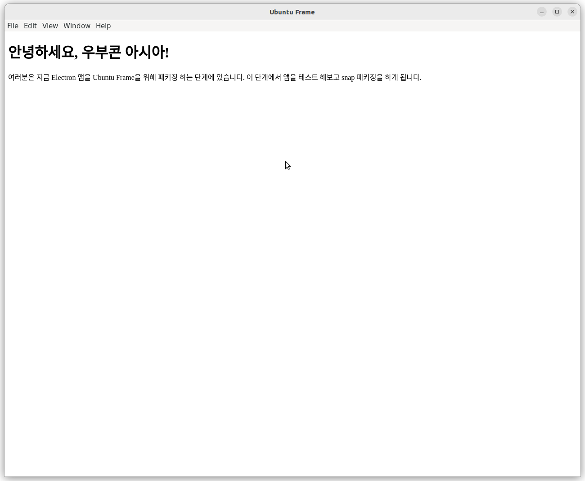
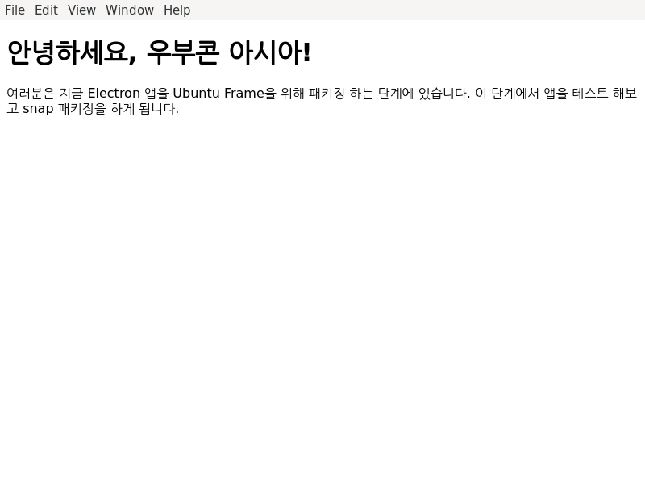

이번 글에선 전번 Ubuntu Frame 소개에 이어서 실습하는 과정을 소개하고자 합니다.

## 데스크톱 환경에서 실습하기
Ubuntu Frame은 데스크톱, 가상환경, 물리기기에서 모두 실행이 가능합니다.
이 중에서 데스크톱 환경에서는 기본적으로 ```daemon=false```로 설정이 돼 있기 때문에  ```ubuntu-frame```이 실행되면 화면 전체가 ```ubuntu-frame```로 점유 되기 보다는 데스크톱 환경에 스크린 시뮬레이터가 창 형태로 실행되서 개발과 패키징 도중에 앱을 실험 해보기 좋습니다.
때문에 공식 문서의 [데스크톱 환경에서 Ubuntu Frame 실행하기](https://mir-server.io/docs/run-ubuntu-frame-on-your-desktop) 가이드를 먼저 따라해보면서 Ubuntu Frame에 대해 알아보겠습니다.

우선 아래 명령어로 현재 세션에 설정된 wayland socket을 확인 해보겠습니다.
```
$ ls $XDG_RUNTIME_DIR/wayland*
/run/user/1000/wayland-0  /run/user/1000/wayland-0.lock  
```
환경변수 ```$XDG_RUNTIME_DIR```은 현재 로그인 된 데스크톱 세션과 관련된 디렉토리로, 현재 로그인 된 유저와 관련된 파일들이 이곳에 위치하게 됩니다. 다시말해 위의 ```/run/user/*/wayland-0*``` 파일들은 현재 로그인 된 유저에 대해 설정된 wayland socket 파일들입니다.

이제 Ubuntu Frame을 설치하고 실행해보겠습니다. 아래 명령어로 Ubuntu Frame을 설치합니다.
```
$ snap install ubuntu-frame
```
위 앱을 실행하면 해당 디스플레이 서버가 wayland socket을 생성해 GUI 앱을 붙여 보는 것이 가능합니다. 해당 소캣은 패키징 할 때 환경변수 ```$XDG_RUNTIME_DIR/$WAYLAND_DISPLAY```로 설정되서 사용됩니다.

이제 ```ubuntu-frame```을 실행하는데 아래와 같은 두 가지 방식이 존재합니다.
* 현재 유저로 실행하기
  - 이 방법으로 실행하면 ```ubuntu-frame```이 현재 유저가 실행시킨 프로세스가 되고 ```$XDG_RUNTIME_DIR/$WAYLAND_DISPLAY``` 소캣의 소유자가 현재 유저가 됩니다. 실행 방법이 단순하기 때문에 패키징을 하지 않고 단순히 동일한 유저가 실행시킨 GUI 앱을 ```ubuntu-frame```에 붙여 볼 때 유용합니다.
* root로 실행하기
  - 이 방법은 ```ubuntu-frame```의 실제 실행 환경과 조금 더 유사하기 때문에 패키징 했을 때 환경을 시험해보기 좋습니다. ```ubuntu-frame```이 생성하는 wayland socket가 소유자가 root가 아니면 ```ubuntu-frame```과 통신하려는 프로세스의 소유자가 다르면(심지어 root라도) 접속할 수 없기 때문에 ```init```이 생성한 프로세스(이를테면 daemon)들과 통신하려면 root로 실행할 필요가 있습니다. 이 방법은 현재 유저로 실행하는 것보다 조금 더 복잡합니다.

여기에서는 현재 유저로 실행하는 것만 다루겠습니다. 아래 명령어로 실행하고 생성된 소켓을 확인합니다.
```
$ WAYLAND_DISPLAY=wayland-99 ubuntu-frame
$ ls $XDG_RUNTIME_DIR/wayland*
/run/user/1000/wayland-0       /run/user/1000/wayland-99
/run/user/1000/wayland-0.lock  /run/user/1000/wayland-99.lock
```
위 명령어로 ```ubuntu-frame```을 환경변수 ```$WAYLAND_DISPLAY```를 넘겨줘서 실행한다는 의미입니다. 해당 명령어로 새로운 시뮬레이터 창이 생성되고 ```wayland-99``` 소캣을 생성한 것을 볼 수 있을 겁니다.

저는 이것을 electron-quick-start 프로그램을 약간 수정한 프로그램으로 실험해보겠습니다. 다음 명령어로 해당 프로그램을 실행해봅시다.
```
$ git clone https://github.com/onting/electron-ubucon-asia.git
$ cd electron-ubucon-asia
$ npm install
$ npm start
```

위와 같은 프로그램을 이제 ```ubuntu-frame```에 다음과 같은 명령어로 붙입니다.
```
export WAYLAND_DISPLAY=wayland-99
npm start -- --enable-features=UseOzonePlatform --ozone-platform=wayland
```
그러면 다음과 같이 스크린 시뮬레이터에 앱이 붙은 것을 볼 수 있을 겁니다.


다음은 이 앱을 Ubuntu Frame을 위해서 snap 앱으로 패키징하는 과정입니다.

## Electron 앱 패키징
이제 공식 문서의 [Electron 앱 패키징 하기](https://mir-server.io/docs/packaging-a-flutter-application-as-an-iot-gui)를 따라해보겠습니다. 이 과정에서는 Electron 위에서 다루었던 앱을 [```iot-example-graphical-snap```](https://github.com/MirServer/iot-example-graphical-snap) 코드를 활용해서 Ubuntu Frame을 위한 snap 패키징을 하는 것을 다룹니다.

우선 ```iot-example-graphical-snap```을 다운로드 받고 사용 가능한 예시들을 보겠습니다.
```
$ git clone https://github.com/MirServer/iot-example-graphical-snap.git
$ cd iot-example-graphical-snap
$ git branch -a
* master
remotes/origin/GTK3-mastermind
remotes/origin/HEAD -> origin/master
remotes/origin/Qt5-bomber
remotes/origin/SDL2-neverputt
remotes/origin/master
```
위와 같이 브렌치들을 살펴보면 GTK3, SDL2-neverputt 등 다양한 예시를 제공한다는 것을 알 수 있습니다. 다음 명령어로 기본 Electron 패키징 예시를 실행해보겠습니다.
```
$ git checkout Electron-quick-start
$ snapcraft
$ ls
bors.toml  iot-example-graphical-snap_0+git.f5b57f7_amd64.snap  README.md  wayland-launch
dbus       LICENCE                                              snap       wrapper
```
위와 같이 ```iot-example-graphical-snap_*_*_.snap``` snap 패키지 파일이 생성된 것을 확인할 수 있습니다.

이제 ```snap/snapcraft.yaml``` 파일에서 레시피가 어떻게 구성돼있는지 확인하고 앞서 소개드린 ```electron-ubucon-asic``` 프로그램을 패키징 하는 것으로 바꿔보겠습니다.

```yaml
...

parts:
  electron-helloworld:
    plugin: nil
    source: https://github.com/electron/electron-quick-start.git
    build-environment:
      - PATH: "$PATH:$SNAPCRAFT_PART_BUILD/node_modules/.bin"
    override-build: |
      set +u # core20 base does not allow unbound variables !
      # workaround for build.snapcraft.io builds
      # https://bugs.launchpad.net/bugs/1886861
      if [ -n "$http_proxy" ]; then
        export ELECTRON_GET_USE_PROXY=1
        export GLOBAL_AGENT_HTTP_PROXY="${http_proxy}"
        export GLOBAL_AGENT_HTTPS_PROXY="${http_proxy}"
      fi

      # Replace the default app with the Mir website
      sed --in-place "s!loadFile('index.html')!loadURL('https://mir-server.io')!" main.js

      npm install --unsafe-perm true electron-packager
      electron-packager . --overwrite --platform=linux \
          --output=release-build --prune=true
      cp -a ./electron-quick-start-linux-* $SNAPCRAFT_PART_INSTALL/electron-helloworld
      chmod a+rx $SNAPCRAFT_PART_INSTALL/electron-helloworld
    stage-packages:
      - libnspr4
      - libnss3
      - libatk-bridge2.0-0
      - libcups2
      - libgtk-3-0
      - libasound2
    build-snaps:
      - node/16/stable

...
```
```snap/snapcraft.yaml```파일을 열어보면 다양한 속성들이 존재합니다만 편의를 위해 ```parts``` 만 살펴보겠습니다. 각 속성에 대해 자세히 알기 위해선 [snapcraft.yaml 만들기](https://snapcraft.io/docs/creating-snapcraft-yaml) 가이드를 참고하십시오.
다시 돌아와, 우리가 바꿀 부분은 ```parts``` 속성의 ```electron-helloworld``` 부분입니다. ```parts```는 패키지를 구성하는 요소들을 의미하는데 앱, 라이브러리, 정적 에셋 등 다양한 요소들이 part로 기술 될 수 있고 part를 위한 빌드, 실행 환경, 의존성 등을 포함할 수 있습니다.
기본적으로 snap 패키지는 가져오는 소스코드로 부터 자동적으로 빌드를 하려 시도하고 npm, cmake, autotools 등의 빌드 시스템 통합을 위해서 ```plugin``` 속성이 사용 될 수 있지만 위와 코드와 같이 ```override-build```를 통해서 직접 빌드 과정을 기술할 수 있습니다. 또한 ```stage-package```에 배포에 포함할 패키지를 기술해 의존성 패키지나 원격 접속을 위한 툴 등을 포함을 수 있습니다.

다음과 같이 레시피를 수정합니다.
1. 현재 ```override-build```는  ```sed --in-place "s!loadFile('index.html')!loadURL('https://mir-server.io')!" main.js```와 같이 ```index.html```을 렌더링하는 대신 mir-server 홈페이지를 불러오도록 바꾸는 부분이 있는데 앱 변경 반영을 위해서 지워줍니다.
2. ```source``` 부분에 ```https://github.com/onting/electron-ubucon-asia.git```을 넣어줍니다.
3. ```stage-packages```에 현재 패키지에 한글 폰트를 포함시키기 위해서 나눔폰트를 추가해줍니다. 패키지명은 현재 시스템이 apt인지 yum인지에 따라서 패키지명을 적어주면 되고 우분투 기준으로는 ```fonts-nanum```, ```fonts-nanum-coding```, ```fonts-nanum-extra```를 추가하면 됩니다.

그리고 다음과 같이 확인해봅니다.
```
$ rm *.snap
$ snapcraft
$ snap install --dangerous *.snap
$ snap run iot-example-graphical-snap
```
이는 다음과 같은 오류를 발생할 수 있습니다.
```
WARNING: wayland interface not connected! Please run: /snap/iot-example-graphical-snap/current/bin/setup.sh
[231190:0624/162014.069287:ERROR:wayland_connection.cc(209)] Failed to connect to Wayland display
[231190:0624/162014.069317:ERROR:ozone_platform_wayland.cc(226)] Failed to initialize Wayland platform
[231190:0624/162014.069322:ERROR:env.cc(226)] The platform failed to initialize.  Exiting.
The futex facility returned an unexpected error code.
```
이는 snap confinement에 의한 오류로 앱이 실행되는데 필요한 인터페이스들이 연결되지 않아서 발생합니다. 이를 해결하기 위한 스크립드 또한 제공되기에 다음과 같이 실행해 해결합니다.
```
$ /snap/iot-example-graphical-snap/current/bin/setup.sh
$ snap run iot-example-graphical-snap
```
이제 다음과 같은 창이 뜰 겁니다.

위 화면이 배포됐을 때 화면이라 보면 됩니다.

## Ubuntu Core로 실습하기
이제 Ubuntu Core 시스템 위에 전 단계에서 패키징한 패키지를 설치해 실행하는 것을 해보겠습니다.
이 과정을 위해서는 [Ubuntu One 계정](https://login.launchpad.net/)에 ssh 공개키가 등록되어 있어야 합니다.
키 등록을 위한 과정은 launchpad의 [ssh 키 쌍 생성](https://help.launchpad.net/YourAccount/CreatingAnSSHKeyPair) 가이드를 참고하십시오.

우선 패키지를 해당 기기로 쉽게 옮기고 설치하기 위해서 다음 명령어로 Snap Store에서 앱을 빌드합니다.
```
$ snapcraft remote-build
$ ls *.snap
iot-example-graphical-snap_0+git.f5b57f7-dirty_amd64.snap  iot-example-graphical-snap_0+git.f5b57f7-dirty_armhf.snap
iot-example-graphical-snap_0+git.f5b57f7-dirty_arm64.snap
```
이 명령어는 Snap Store의 인프라로 해당 레시피에 기술되어있는 모든 아키텍쳐로 빌드를 해줍니다. 다만 서버로 전송되는 모든 데이터는 공개될 수 있음을 주의해야 합니다.

다음으로 Ubuntu Core 이미지를 실행하는데 편의를 위해 이 글에선 QEMU로 진행하겠습니다. 자세한 내용을 위해선 [가상머신에 Ubuntu Frame 실행하기](https://mir-server.io/docs/run-ubuntu-frame-in-a-virtual-machine) 가이드를 참고하십시오.
아래와 같이 QEMU를 설치합니다.
```
$ sudo snap install qemu-virgil
$ sudo snap install connect qemu-virgil:kvm
$ qemu-virgil --version
```
이후 아래와 같이 Ubuntu Core 이미지를 다운로드 받고 실행합니다.
```
$ wget https://cdimage.ubuntu.com/ubuntu-core/20/stable/current/ubuntu-core-20-amd64.img.xz
$ unxz https://cdimage.ubuntu.com/ubuntu-core/20/stable/current/ubuntu-core-20-amd64.img.xz
$ qemu-virgil -enable-kvm -m 512 -device virtio-vga,virgl=on\
 -display sdl,gl=on -netdev user,id=ethernet.0,hostfwd=tcp::10022-:22\
 -device rtl8139,netdev=ethernet.0\
 -drive file=/snap/qemu-virgil/current/usr/share/qemu/edk2-x86_64-code.fd,if=pflash,format=raw,unit=0,readonly=on\
 ./ubuntu-core-20-amd64.img
```
창이 실행 된 후 Ubuntu One 계정을 넣어서 초기화 합니다.
이후 다음 명령어로 패키지 파일을 옮기고 접속해 설치합니다.
```
$ scp -P 10022 *_amd64.snap <your-user>@localhost:~
$ ssh -p 10022 <your‑user>@localhost
$ snap install ubuntu-frame
$ snap install --dangerous *.snap
```

## 회고와 정리
여기까지가 작년 워크숍에서 다룬 내용입니다. 개인적으로 지난 행사는 평소 개인적 관심으로 조금씩 살펴본 Ubuntu Frame 내용을 정리하는 계기가 됐습니다. 행사 준비를 위해서 Ubuntu Frame 튜토리얼을 심화 단계까지 따라해보면서 Ubuntu Frame의 구조를 더 잘 이해할 수 있었고, snap packaging이 실제로 어떻게 이루어지는지를 실제로 볼 수 있었습니다. Ubuntu Core의 장점과 한계점 또한 정리해볼 수 있었습니다. 캐노니컬사의 임베디드 포트폴리오 전반을 살펴보면서 저는 해당 전략이 보안성, 재개발 비용, 유지보수성 면에서 우수해서 넓은 범위로 산업에서 적용될 여지가 충분하다고 느꼈습니다. 그러나 Ubuntu Core 근본적으로 snap 버그 등의 이유로 안정성 등이 현재 엄격한 시험대에 올라가 평가 받고 있는 상태라고 생각합니다. 그래서 가까운 미래의 사용자 경험이 평판에 매우 중요하다고 보여집니다. 덧붙여 Ubuntu Frame 또한 실제로 써보면 개념 만큼 개발이 간단하지는 않고 추가적으로 알아야 할 것들이 꽤나 있다는 것을 튜토리얼을 해보면서 느꼈습니다. 저는 앞으로 Ubuntu Core가 신뢰도를 위해서 어떤 행보를 보일지 또 한국 임베디드 산업에도 이런 기술이 정착할 수 있을지 흥미롭습니다.