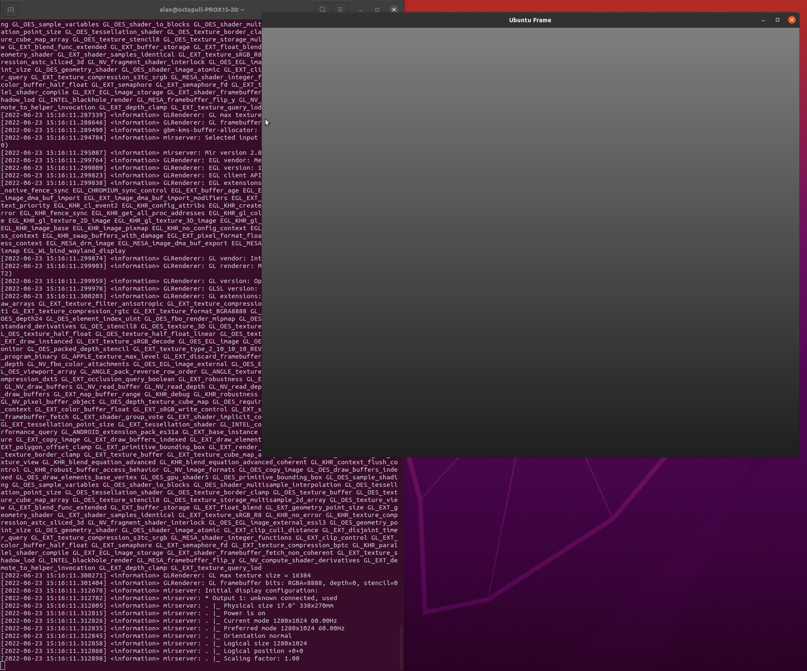
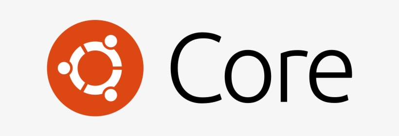
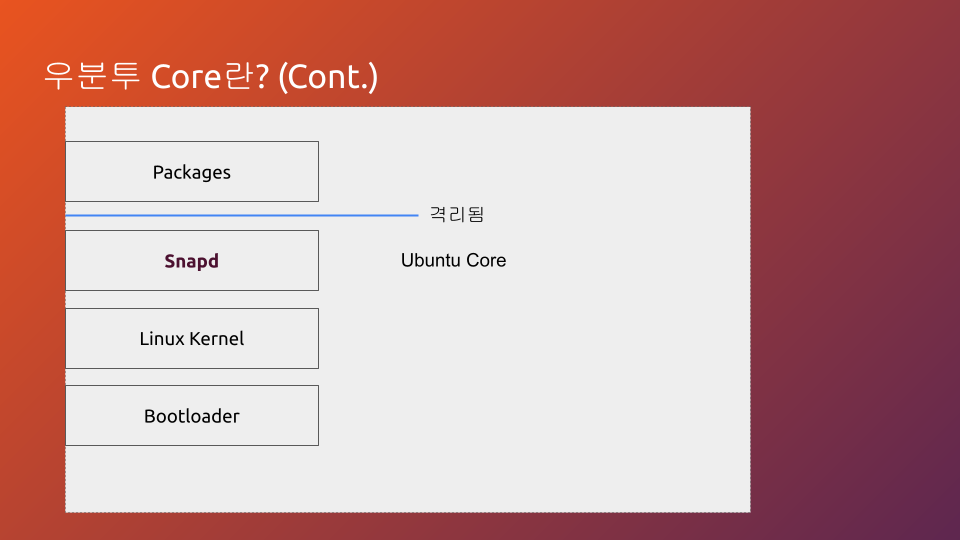
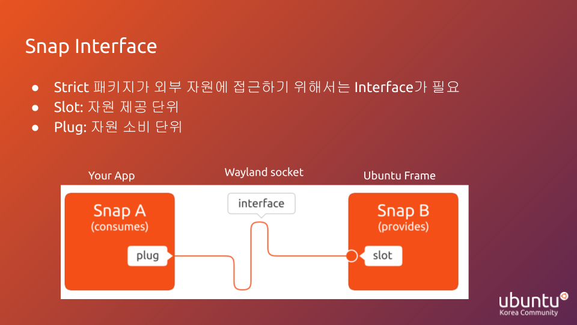
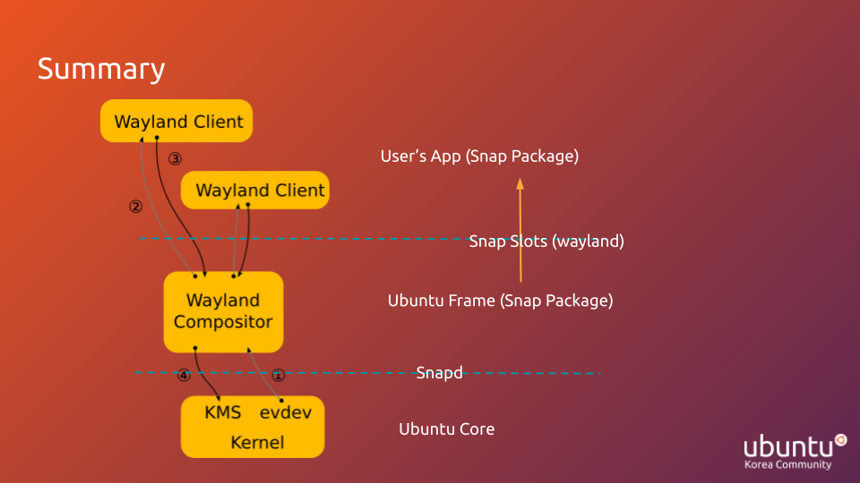

## Table of Contents
1. [서론](#서론)
2. [우분투 Core & Frame](#우분투-core--frame)
3. [데스크톱 환경에서 실습하기](#desktop-환경에서-실습하기)

## 서론
수년 전인가 부터 임베디드와 IoT가 4차 산업혁명이라는 말로 강조 되기 시작했습니다. 사실 임베디드 시스템은 훨씬 예전 부터 우리 생활에 밀접하게 자리 잡아 있었지만 딥러닝의 등장으로 전에 불가능했던 수많은 앱들이 앞으로 실현 가능할 것이라 보고 앞으로는 edge 기기들 증가하고 통신의 중요성이 화두가 될 것이라 보는 것이죠. 그러나 이런 전망에도 불구하고 저는 임베디드의 기반 시스템 개발 부분은 앱 개발 만큼 논의가 활발히 이루어 지지 않는다고 느낍니다.
아직도 맞춤형 OS는 유지보수, 개발 난이도 등의 문제들을 합리적으로 다루기 어려워서 데스크톱용 OS에 GUI 앱을 올리는 형태로 많이 개발 되고 있는 행태입니다.


이와 관련해 조사해서 2022년도 Ubucon Asia에서 발표했던 Ubuntu Frame에 대한 워크숍 내용을 이 글에 정리하려 합니다.
필요에 따라 [워크숍 슬라이드 파일](https://docs.google.com/presentation/d/1scBM6nhjr_amlooKgobwNzKSSdhIdW7i4rp9tW1bfQE/edit?usp=sharing)을 통해 요약된 내용을 확인하기 바랍니다.

## 우분투 Core & Frame

### 1. Ubuntu Frame이란?
Ubuntu Frame은 GUI 임베디드 및 IoT 시스템 개발을 위해 작년 10월 경에 출시 된 Canonical 사의 제품으로 Ubuntu Core와 함께 임베디드 개발에 활용 될 수 있습니다.
[Ubuntu Frame의 공식 설명](https://github.com/MirServer/ubuntu-frame#description)을 보면 Ubuntu Frame은 "다양한 임베디드 그래픽 디스플레이 구현을 위한 기반이며, 단순한 Full-screen Shell을 제공해서 키오스크, 안내판 등에 활용될 수 있다."라고 설명되고 있습니다. 즉 아래 그림과 같은 단순히 회색 화면만 있는 창이 디스플레이를 점유하는 환경을 제공하는 것입니다.


Ubuntu Frame은 이와 같이 GUI 앱이 전체 화면을 점유할 수 있는 단순한 Shell을 제공하며 마우스, 키보드, 터치스크린 등의 다양한 I/O도 가능합니다. 또한, Ubuntu Frame은 Ubuntu Core 위에서 실행되는 것이 권장되지만 일반 리눅스 배포판에서도 실행이 가능합니다.

그런데 이런 기본적인 GUI 환경이 왜 제공되는지에 대한 등장 배경과 Ubuntu Frame의 구조를 이해하기 위해서 Ubuntu Core에 대해 설명하겠습니다.

### 2. Ubuntu Core 소개
우선 소개에 앞서 우리가 임베디드 개발에서 커스텀 리눅스 이미지가 필요하게 되는 이유와 이것이 실제로 어려운 이유를 짚어보겠습니다. 
임베디드 시스템에서는 다양한 작업을 해야하는 PC와 달리 정해진 작업들을 안정적으로 수행하는 것이 중요합니다. 반면, 컴퓨터 시스템에서 더 많은 기능들은 더 많은 결함 발생 가능성을 의미하기 때문에 안정성과 하드웨어 비용을 위해서 리눅스 이미지 맞춤 제작이 임베디드에서는 화두되고 있습니다. 그러나 리눅스 맞춤 제작은 실제로는 굉장히 어려운 문제입니다. 리눅스를 스스로 개발한다는 것은 리눅스 배포판이 관리해주던 커널 컴파일, 디바이스 드라이버, 설치 등을 개발자가 Root File System을 생성 할 때 스스로 고려를 해야 한다는 것을 의미하고 더욱이 시스템이 GUI를 사용해야 한다면 디스플레이 서버 프로토콜을 고려해야하는 등 문제가 복잡합니다. 그리고 개발을 하고 배포했을 때에도 시스템 배포 후 원격 접속, 업데이트, 모니터링 등의 유지보수가 어려워지는 문제 또한 생기게 됩니다.


여기에서 [Ubuntu Core](https://ubuntu.com/core)가 등장하게 됩니다. Ubuntu Core는 임베디드 시스템을 위해서 리눅스 이미지를 맞춤 제작을 하기 보다는 리눅스 배포판의 장점을 적용해 개발과 관리를 용이하게 하겠다는 접근입니다.
일단 Ubuntu Core는 임베디드를 위한 리눅스 배포판입니다. Ubuntu Core는 보안과 유지보수를 강화했고 OS 이미지 또한 임베디드에 맞게 260MB 정도로 초 경량화 됐습니다. 또한, 패키지를 전부 snap으로 관리해서 보안성과 의존성 문제를 향상했고 [Snap Store](https://snapcraft.io/store)가 사용 가능해서 배포/재배포가 용이합니다.

반면 Ubuntu Core에서는 특이하게 보통 Ubuntu와 다르게 패키지 관리자가 Snap만 이용 가능하고 APT는 사용할 수 없습니다. 이는 Snap을 이용해서 보안을 향상하기 위해서 인데 Snap은 차세대 패키지 관리자로 아래 그림과 같은 격리된 앱 실행 환경을 제공해서 보안와 의존성 문제를 향상 시킵니다.


Snap의 이런 격리된 앱 실행 환경을 [Snap Confinement](https://snapcraft.io/docs/snap-confinement)라고 부르는데 도커와 비슷하게 snap에서는 앱이 격리된 상태로 패키징 되서 배포 됩니다. 이런 격리 환경은 기존에 앱들이 시스템 자원들을 권한만 갖고 있으면 무제한으로 사용 가능했던 것과 구분되게 Snap 앱들은 각 패키지 간에 [Interface](https://snapcraft.io/docs/interface-management)라는 형태로 사전에 서로 합의된 자원에만 접근할 수 있습니다. 이런 snap의 자원 추상화인 Interface에는 아래 그림과 같이 두 가지 단위가 있습니다.


바로 Slot과 Plug입니다.
그림에 나와 있듯 slot은 자원 제공 단위, plug는 자원 소비 단위입니다. 이를 우리가 살펴볼 Ubuntu Frame을 기준으로 생각해보면 우선 ubuntu-frame은 snap 패키지로 제공이 됩니다. 이때 ubuntu-frame 앱은 사실 Wayland compositor로서 GUI 앱을 서비스 할 수 있는 디스플레이 서버인데, 앱이 통신할 수 있는 Wayland socket은 해당 패키지의 slot으로서 제공이 됩니다. 반면 우리가 임베디드 시스템에서 사용할 GUI 앱은 Snap 패키지로 배포 돼서 plug가 되는 것이죠.


### 3. Ubuntu Frame 살펴보기
이제 우리는 Ubuntu Frame의 등장 배경과 구조를 이해할 수 있습니다. RootFS의 최소화, 보안성, 유지보수 용이성 등을 위해서 임베디드 특화 리눅스인 우분투 Core가 등장했고, 이런 장점을 유지할 수 있는 최소 GUI Shell인 Ubuntu Frame이 이에 맞추어 출시됐습니다. Snap 패키지만 사용 가능한 Ubuntu Core의 환경에 맞게 Ubuntu Frame은 Snap 패키지로 Wayland Socket을 slot으로 제공하고 사용자 배포 앱은 여기에 plug로 붙어서 서비스 될 수 있습니다. 즉, Ubuntu Frame은 Wayland 프로토콜을 지원하는 다양한 GUI 앱들을 지원해서 GTK+, QT, Flutter, HTML5 등의 다양한 툴킷으로 앱 개발이 가능합니다. 또한 X.org 프로토콜을 지원하는 기존 앱들도 경량 X 서버를 포함하는 것으로 지원할 수 있습니다.
또한 snap store를 이용해서 임베디등의 어려운 문제인 배포/재배포를 용이하게 합니다.

Ubuntu Frame은 다음 3가지 설정 옵션을 제공합니다. ```snap set``` 명령어로 설정 가능합니다.

* ```daemon=[true|false]```
  - daemon을 활성화 합니다.
  - ```true```로 설정되면 Ubuntu Frame이 스크린 전체를 점유하게 되고 deployment에 필요합니다. 데스크톱 리눅스에서는 기본 ```false```로 설정 되어있고 이는 ```ubuntu-frame```을 실행할 때 스크린 시뮬레이터를 실행하게 합니다.

* ```config=<options for the shell>```
  - 위 옵션으로 ```ubuntu-frame```의 설정 파일을 수정할 수 있습니다.
  - 바탕화면, 돌리기, 그라데이션 등의 다양한 옵션을 설정합니다.
* ```display=<options for the shell>```
  - 장치를 설정할 수 있는 옵션입니다.
  - 그래픽 카드나 시스템 출력 등의 하드웨어 정보를 다룰 수 있습니다.
  - ```frame.display``` 파일에서 설정을 위한 템플릿을 확인 할 수 있습니다.

### 4. 요약 및 결론

위 그림은 Wayland 프로토콜 메시지 교환 구조에 제 Ubuntu Frame 설명을 추가한 것입니다.
그림에 빗대어 밑에서 부터 앞선 설명을 회고하고 정리하겠습니다.

1. 가장 밑 부분은 커널 부분입니다. 리눅스 커널을 통해서 여러 디바이스 드라이버 등과 결합되서 추상화된 프로그래밍 환경이 제공되고 이런 커널 부분을 편리하게 관리하는 것이 리눅스 배포판의 역할 중 하나입니다. 너무 많은 기능이 존재하는 데스크톱 리눅스 대신에 Ubuntu Core를 통해서 기능 최소화, 보안 향상, 쉬운 디바이스 드라이버 설치/관리가 가능합니다.
2. 그러나 GUI 시스템에는 커널 말고도 디스플레이 서버를 관리해야할 필요가 생깁니다. 이는 디스플레이 서버 프로토콜과 추가적인 패키지 관리 등의 어려움이 생기기 때문에 Ubuntu Frame이 Wayland Compositor를 제공해서 이를 위한 의미있는 추상화를 제공합니다.
3. 마지막으로 프로그래머는 Wayland 앱을 작성해서 Snap으로 배포해 ```ubuntu-frame```에 붙어서 wayland client로 서비스 되게 됩니다.

분량 조절을 위해서 이 글에선 Ubuntu Frame에 대한 개념 설명을 다음 글에서 실습을 해보겠습니다.